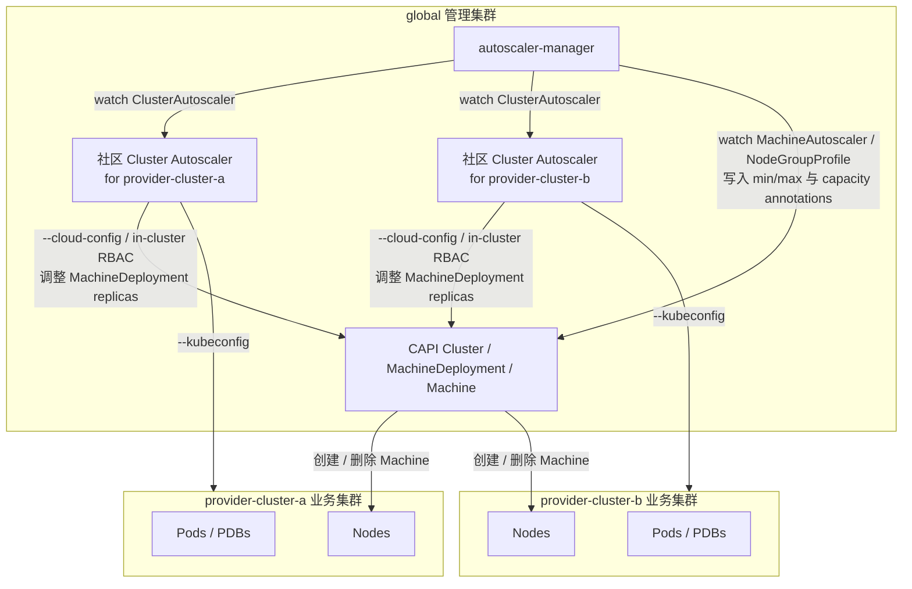
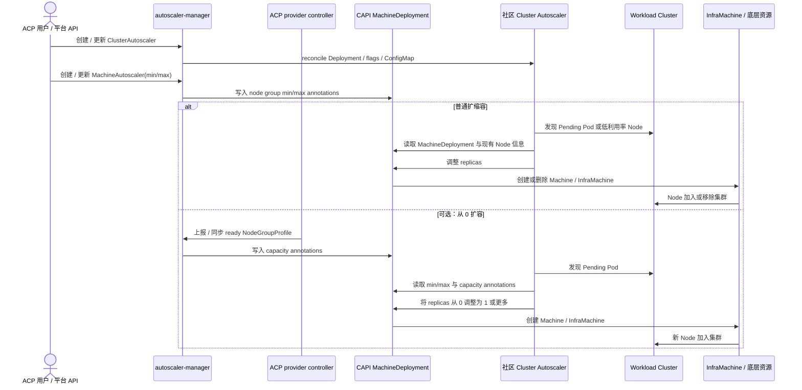

# OCP 与社区 Cluster Autoscaler 能力调研及 ACP 方案建议

本文用于梳理 OpenShift Container Platform（OCP）Cluster Autoscaler、社区 Kubernetes Cluster Autoscaler、Cluster API（CAPI）autoscaling 之间的关系，并给出 ACP 的产品化方案建议。

ACP 的前提假设是：ACP 对接的基础设施 provider 都基于 CAPI 实现，因此节点生命周期管理抽象更接近 CAPI 的 `MachineDeployment` / `MachineSet` / `MachinePool` / `Machine`，而不是 OCP 的 Machine API。

需要提前说明的是，社区 Cluster Autoscaler 的 `clusterapi` cloud provider 可以围绕 CAPI `MachineDeployment`、`MachineSet`、`MachinePool` 做扩缩容；但 ACP 初版设计只基于 `MachineDeployment` 完成产品化封装。也就是说，`MachineAutoscaler` 只引用 `MachineDeployment`，`autoscaler-manager` 也只向 `MachineDeployment` 注入 autoscaler 相关 annotations。`MachineSet` 和 `MachinePool` 仅作为背景能力讨论，不纳入本文推荐的 ACP 初版实现范围。

## 0. 版本与适用范围

本文基于 OCP 4.21 文档、社区 Cluster Autoscaler `cluster-autoscaler-release-1.35` 分支以及 CAPI `cluster.x-k8s.io` API 体系进行分析。不同 OCP 版本、Cluster Autoscaler 版本和 CAPI provider 对 flags、expander、scale-from-zero 模板、`MachinePool` 支持和 annotations 的暴露范围可能不同；与本文分析不一致时，应以 ACP 实际选定版本和本地代码实现为准。

本文讨论的是节点自动扩缩容架构选型，不覆盖 HPA / VPA / KEDA 等 workload 级弹性能力。

## 1. 结论摘要

ACP 推荐采用：

```text
社区 Kubernetes Cluster Autoscaler
  -> --cloud-provider=clusterapi
  -> ACP 初版只管理 CAPI MachineDeployment
  -> CAPI Machine / InfraMachine
  -> VM / Instance / Bare Metal Host
  -> Kubernetes Node
```

产品层可以提供 OCP 风格的 CRD 体验，但底层不建议引入 OCP Machine API，也不建议开发 ACP 自己的 Cluster Autoscaler cloud provider。

推荐的 ACP 产品化链路是：

```text
ACP ClusterAutoscaler CR
  -> 声明目标业务集群、是否启用 autoscaler、集群级 autoscaler 配置
  -> autoscaler-manager
  -> 在 global 集群创建 / 更新对应的社区 Cluster Autoscaler Deployment

ACP MachineAutoscaler CR
  -> 单个 CAPI MachineDeployment 的 min/max
  -> autoscaler-manager
  -> CAPI MachineDeployment autoscaler annotations

ACP NodeGroupProfile CR（可选，从 0 扩容需要）
  -> provider 同步的新节点调度画像
  -> autoscaler-manager
  -> CAPI scale-from-zero annotations

社区 Cluster Autoscaler
  -> 实时做扩容、缩容、调度模拟和 expander 决策
```

核心判断：

- 社区 Cluster Autoscaler 已经内置 `clusterapi` cloud provider，ACP 基础方案不需要改造社区 autoscaler。
- ACP 需要新增的是产品层 controller，例如 `autoscaler-manager`，负责根据 `ClusterAutoscaler` 部署社区 Cluster Autoscaler 实例，并根据 `MachineAutoscaler`、`NodeGroupProfile` 等资源把扩缩容配置翻译成 CAPI `MachineDeployment` annotations。
- 实时扩缩容决策仍由社区 Cluster Autoscaler 完成，ACP controller 不参与每次 Pending Pod 的调度模拟。
- ACP 初版的 node group 统一指 CAPI `MachineDeployment`；`MachineSet` 和 `MachinePool` 只用于解释 OCP / 社区能力差异，不作为 ACP 初版 API 目标。
- `NodeGroupProfile` 是 ACP 为产品化从 0 扩容提出的可选抽象，不是 Kubernetes、CAPI 或社区 Cluster Autoscaler 的现有 API。
- 从 0 扩容需要准确的新节点调度属性，ACP 可以在方案层引入 provider 可维护的节点组调度画像。

一句话概括：**ACP 对齐 OCP 的产品体验和职责拆分，但底层复用社区 Cluster Autoscaler + CAPI provider，而不是复刻 OCP Machine API。**

## 2. Cluster Autoscaler 的通用机制

Cluster Autoscaler 解决的是“节点数量是否需要变化”的问题。

它不直接根据节点 CPU 使用率扩容，也不替代 HPA / VPA / KEDA。它主要看两类信号：

```text
扩容：是否存在因资源或调度约束无法调度的 Pending Pod
缩容：是否存在长期低利用率且可以安全清空的 Node
```

### 2.1 扩容、缩容和 expander 决策

典型扩容过程：

```text
发现 Pending Pod
  -> 模拟不同 node group 扩一个节点后能否承载 Pod
  -> 选择合适的 node group
  -> 调用 provider / machine API 增加节点
  -> 新节点加入集群
  -> Pending Pod 被调度
```

扩容判断会考虑：

- CPU / memory request。
- GPU / extended resources。
- `nodeSelector`。
- node affinity / anti-affinity。
- taint / toleration。
- topology spread。
- volume topology。
- Pod affinity / anti-affinity。

如果 Pod Pending 的原因是错误的调度约束，而不是新增节点可以解决的容量不足，Cluster Autoscaler 不一定会扩容。

典型缩容过程：

```text
发现低利用率 Node
  -> 判断低利用率是否持续足够长时间
  -> 判断 Node 上的 Pod 是否可以被驱逐
  -> 模拟这些 Pod 是否能在其他 Node 重新调度
  -> cordon / drain Node
  -> 删除底层 Machine / VM / 实例
  -> Node 从集群中移除
```

缩容比扩容更容易被阻塞，常见原因包括：

- PodDisruptionBudget 过于严格。
- Pod 使用本地存储。
- Pod 不是由 Deployment、ReplicaSet、StatefulSet、DaemonSet、Job 等控制器管理。
- Pod 标记了 `cluster-autoscaler.kubernetes.io/safe-to-evict: "false"`。
- 节点上存在系统关键 Pod。
- Pod 搬迁后无法满足 affinity、anti-affinity、topology spread 等约束。
- 其他节点没有足够资源承载被驱逐 Pod。
- node group 已达到最小副本数。

当多个 node group 都能承载 Pending Pod 时，Cluster Autoscaler 需要选择扩容哪个 node group。常见 expander 策略包括：

- `random` / `Random`：在可行 node group 中随机选择。
- `least-waste` / `LeastWaste`：先过滤出能让 Pending Pod 调度成功的 node group，再比较新增节点后的 CPU / memory 剩余比例，选择资源浪费更少的方案。
- `priority` / `Priority`：按配置的 node group 优先级选择。
- `most-pods`：优先选择能承载最多 Pending Pod 的 node group。
- `least-nodes`：倾向于用更少新增节点完成调度。
- `price`：基于成本选择，适合 provider 能提供价格信息的场景。
- `grpc`：通过外部 gRPC expander 决策。

`least-waste` 优化的是装箱效率，不等同于最低成本。GPU、label、taint、zone 等通常先决定“这个 node group 能不能成为候选”，CPU / memory waste 再决定候选里谁更省。

`priority` 规则通常是静态配置，但候选资格会随 Pending Pod、调度约束、max size、provider backoff 等实时变化。平台常见组合是：

```text
priority,least-waste
```

即先表达业务或成本偏好，再在同优先级候选中选择资源浪费更少的方案。

### 2.2 node group 抽象与管理范围

Cluster Autoscaler 不直接管理“所有 Node”，而是管理它能识别的 node group。Node 是否属于 autoscaler 管理范围，取决于它能否映射到一个已发现、可扩缩容的 node group。

不同平台的 node group 抽象不同：

```text
云厂商 ASG 模型：
Cluster Autoscaler -> 云厂商 ASG / node pool -> VM -> Node

OCP 模型：
ClusterAutoscaler -> MachineAutoscaler -> MachineSet -> Machine -> Node

CAPI 模型：
Cluster Autoscaler -> MachineDeployment / MachineSet / MachinePool -> Machine -> InfraMachine -> Node
```

从社区能力看，`clusterapi` cloud provider 可以围绕 CAPI `MachineDeployment`、`MachineSet`、`MachinePool` 建模；从 ACP 初版产品设计看，本文后续只把 CAPI `MachineDeployment` 作为普通 worker node group，不把 `MachineSet` 或 `MachinePool` 纳入 ACP 初版实现范围。

在社区 Cluster Autoscaler + CAPI provider 场景里，可以理解为：

```text
Node
  -> 能通过 providerID 映射到某个 CAPI Machine
  -> Machine 属于 ACP 管理的 MachineDeployment
  -> 该 MachineDeployment 被 clusterapi provider 发现
  -> 该 MachineDeployment 配置了 autoscaler min/max
  -> 该 Node 属于 autoscaler 管理范围
```

通常需要满足以下条件：

1. node group 在 `--node-group-auto-discovery=clusterapi:...` 的发现范围内。
2. node group 有 autoscaler min/max annotations。
3. Node 与 Machine 的 `providerID` 关系正确。
4. provider 能把 Node 归属映射回对应 node group。

例如：

```yaml
apiVersion: cluster.x-k8s.io/v1beta1
kind: MachineDeployment
metadata:
  name: worker-md-0
  annotations:
    cluster.x-k8s.io/cluster-api-autoscaler-node-group-min-size: "1"
    cluster.x-k8s.io/cluster-api-autoscaler-node-group-max-size: "10"
spec:
  replicas: 3
```

如果另一个 `MachineDeployment` 没有 min/max annotations，即使它也是 CAPI 管理的节点组，也通常不会被 Cluster Autoscaler 当成可扩缩容 node group。

### 2.3 从 0 扩容为什么特殊

从 0 扩容的关键问题是：node group 当前没有 Node，Cluster Autoscaler 无法从现有 Node 推断新节点能力。

普通扩缩容通常依赖“已有 Node 作为模板”；从 0 扩容没有现成 Node，所以必须从 MachineTemplate、provider status、provider-specific 模板或产品层标准化对象中得到一个“虚拟新节点”的 CPU、memory、labels、taints、GPU、topology 等调度信息，否则调度模拟没有依据。

如果这些信息不准确，就可能出现 autoscaler 以为新节点能承载 Pending Pod，但真实节点加入后 Pod 仍然无法调度的情况。

不同 Cluster Autoscaler provider 获取这些信息的方式不同：有的能从云厂商 instance type 或机器模板推断，有的需要额外 annotations，有的需要平台侧提供标准化信息。ACP 具体如何产品化这件事放到第 6 章说明。

## 3. OCP 如何产品化 Cluster Autoscaler

OCP Cluster Autoscaler 是 OpenShift 面向 Machine API 体系的产品化集成。它不直接管理云厂商 ASG，而是通过 OpenShift Machine API 管理节点生命周期。

典型链路：

```text
ClusterAutoscaler
  -> MachineAutoscaler
  -> MachineSet
  -> Machine
  -> Node
```

### 3.1 OCP 的两个核心 CR

OCP 中常说的 MachineSet autoscaler 对应 CR 实际名称是 `MachineAutoscaler`。它不是节点模板对象，而是面向某个 `MachineSet` 的伸缩边界配置。

| CR | 作用范围 | 主要职责 |
|---|---|---|
| `ClusterAutoscaler` | 集群级 | 配置集群资源上限、缩容参数、部分扩容选择策略等全局行为。 |
| `MachineAutoscaler` | 单个 `MachineSet` | 指定某个 `MachineSet` 是否允许自动扩缩容，以及 min / max 副本数。 |
| `MachineSet` | 单个节点组 | 保存新机器模板，包括 providerSpec、failure domain、labels、taints、bootstrap 引用等。 |

`ClusterAutoscaler` 示例：

```yaml
apiVersion: autoscaling.openshift.io/v1
kind: ClusterAutoscaler
metadata:
  name: default
spec:
  resourceLimits:
    maxNodesTotal: 20
    cores:
      min: 8
      max: 200
    memory:
      min: 32
      max: 1024
  scaleDown:
    enabled: true
    unneededTime: 10m
    utilizationThreshold: "0.5"
```

`MachineAutoscaler` 示例：

```yaml
apiVersion: autoscaling.openshift.io/v1beta1
kind: MachineAutoscaler
metadata:
  name: worker-us-east-1a
  namespace: openshift-machine-api
spec:
  minReplicas: 1
  maxReplicas: 5
  scaleTargetRef:
    apiVersion: machine.openshift.io/v1beta1
    kind: MachineSet
    name: worker-us-east-1a
```

如果只创建 `ClusterAutoscaler`，但没有为目标 `MachineSet` 创建 `MachineAutoscaler`，该 `MachineSet` 通常不会被自动扩缩容。

### 3.2 OCP 如何保持模板与 Node 一致

OCP 的一致性来自同一个 `MachineSet` 同时服务于两件事：

```text
Cluster Autoscaler 调度模拟
  -> 读取 MachineSet / 现有 Node 信息

Machine API 创建真实机器
  -> 使用同一个 MachineSet.spec.template
```

如果 `MachineSet` 当前已有 Node，autoscaler 可以从真实 Node 推断 CPU、memory、labels、taints、topology、GPU 等调度信息。如果副本数为 0，则需要 OCP 对对应平台的 `MachineSet.providerSpec` 和 node template 有内置支持。

因此，`MachineAutoscaler` 本身不需要理解 AWS、Azure、vSphere 或 bare metal 模板字段；不同 provider 的模板语义由 OCP Machine API provider / autoscaler 集成处理。

### 3.3 OCP 从 0 扩容的平台支持

按 OCP 4.21 文档，`MachineAutoscaler.spec.minReplicas` 可以在以下平台上设为 `0`：

- AWS。
- Google Cloud / GCP。
- Azure。
- RHOSP / OpenStack。
- VMware vSphere。

这表示 OCP 对这些平台的 Machine API provider 和 Cluster Autoscaler 集成已经具备必要的 node template 推断能力。副本数为 0 时，autoscaler 没有现成 Node 可参考，需要从 `MachineSet.spec.template`、provider-specific `providerSpec`、failure domain、实例规格或平台元数据中推断新节点的 CPU、memory、labels、taints、topology、GPU 等调度信息。

未列入支持范围的平台，不应默认支持 `minReplicas: 0`。例如 bare metal 场景依赖可用物理机库存和 `BareMetalHost` 状态，OCP 文档没有将其列入 `minReplicas: 0` 支持平台；即使能自动扩容，也通常需要至少保留可作为模板参考的节点或依赖平台明确支持。

另外，OCP 文档提醒不要把 IPI 安装过程中创建的三个默认 compute `MachineSet` 的 `minReplicas` 设为 `0`。更合理的用法是：默认 worker 池保留基础容量，把 `minReplicas: 0` 用在 GPU、大规格、昂贵或低频使用的专用 `MachineSet` 上。

## 4. 社区 Cluster Autoscaler 与 CAPI provider

社区 Cluster Autoscaler 是通用 Kubernetes 节点自动扩缩容组件。它通过 cloud provider / node group provider 接口对接不同基础设施。

常见 provider 包括 AWS、Azure、GCE / GKE、Cluster API、OpenStack Magnum、DigitalOcean、Hetzner、Linode、Oracle Cloud、Scaleway、TencentCloud、Vultr、Rancher 和 external gRPC provider。

### 4.1 社区版的配置入口

社区版通常通过 Deployment 参数、flags、provider 配置和 ConfigMap 管理。

常见参数包括：

```text
--cloud-provider
--nodes
--node-group-auto-discovery
--expander
--scale-down-enabled
--scale-down-unneeded-time
--scale-down-utilization-threshold
--skip-nodes-with-local-storage
--skip-nodes-with-system-pods
```

在 CAPI 场景中，核心参数是：

```text
--cloud-provider=clusterapi
--node-group-auto-discovery=clusterapi:namespace=<capi-cluster-namespace>,clusterName=<workload-cluster>
```

`clusterapi` 是社区 Cluster Autoscaler 内置 cloud provider 名称。它负责读取 CAPI `MachineDeployment`、`MachineSet`、`MachinePool` 等对象，并在扩缩容时调整这些对象的副本数。不同版本支持的对象类型以实际选定的 Cluster Autoscaler / CAPI provider 实现为准；ACP 初版只暴露 `MachineDeployment`。

### 4.2 CAPI 场景下的 min/max 与 scale-from-zero 表达

社区 `clusterapi` provider 通常通过 CAPI `MachineDeployment`、`MachineSet`、`MachinePool` 上的 annotations 表达 node group min/max；ACP 初版只要求在目标 `MachineDeployment` 上写入这些 annotations：

```yaml
metadata:
  annotations:
    cluster.x-k8s.io/cluster-api-autoscaler-node-group-min-size: "1"
    cluster.x-k8s.io/cluster-api-autoscaler-node-group-max-size: "10"
```

从 0 扩容需要额外的 template node 信息。在 Cluster Autoscaler `cluster-autoscaler-release-1.35` 中，`clusterapi` provider 可以从两类来源构造 scale-from-zero 所需的 template node：目标 CAPI `MachineDeployment` 上的 capacity annotations，以及 infrastructure template 的 `status.capacity` / `status.nodeSystemInfo` 等状态字段。

常用 annotations：

| annotation | 必需性 | 作用 |
|---|---|---|
| `cluster.x-k8s.io/cluster-api-autoscaler-node-group-min-size` | 必需 | node group 最小规模；从 0 扩容时通常设为 `"0"`。 |
| `cluster.x-k8s.io/cluster-api-autoscaler-node-group-max-size` | 必需 | node group 最大规模。 |
| `capacity.cluster-autoscaler.kubernetes.io/cpu` | 条件必需 | 新节点 CPU capacity；provider 不能提供 capacity 时必须设置。 |
| `capacity.cluster-autoscaler.kubernetes.io/memory` | 条件必需 | 新节点 memory capacity；provider 不能提供 capacity 时必须设置。 |
| `capacity.cluster-autoscaler.kubernetes.io/ephemeral-disk` | 可选 | 新节点临时磁盘 capacity。 |
| `capacity.cluster-autoscaler.kubernetes.io/maxPods` | 可选 | 新节点最大 Pod 数；未设置时通常按 `110` 处理。 |
| `capacity.cluster-autoscaler.kubernetes.io/labels` | 可选 | 预定义节点 labels，用于模拟 `nodeSelector` / node affinity。 |
| `capacity.cluster-autoscaler.kubernetes.io/taints` | 可选 | 预定义节点 taints，用于模拟 tolerations。 |
| `capacity.cluster-autoscaler.kubernetes.io/csi-driver` | 可选 | 预定义 CSI driver 及 volume limit，例如 `ebs.csi.aws.com=25`。 |
| `capacity.cluster-autoscaler.kubernetes.io/gpu-type` | GPU 可选 | 传统 device plugin 场景的 GPU extended resource 名称，例如 `nvidia.com/gpu`。 |
| `capacity.cluster-autoscaler.kubernetes.io/dra-driver` | GPU 可选 | Kubernetes DRA 场景的 driver 名称；通常与 `gpu-type` 二选一。 |
| `capacity.cluster-autoscaler.kubernetes.io/gpu-count` | GPU 可选 | GPU 数量。 |

示例：

```yaml
metadata:
  annotations:
    cluster.x-k8s.io/cluster-api-autoscaler-node-group-min-size: "0"
    cluster.x-k8s.io/cluster-api-autoscaler-node-group-max-size: "5"
    capacity.cluster-autoscaler.kubernetes.io/cpu: "16"
    capacity.cluster-autoscaler.kubernetes.io/memory: "128G"
    capacity.cluster-autoscaler.kubernetes.io/ephemeral-disk: "100Gi"
    capacity.cluster-autoscaler.kubernetes.io/maxPods: "200"
    capacity.cluster-autoscaler.kubernetes.io/labels: "node-type=gpu,workload=batch,topology.kubernetes.io/zone=zone-a"
    capacity.cluster-autoscaler.kubernetes.io/taints: "workload=batch:NoSchedule"
    capacity.cluster-autoscaler.kubernetes.io/gpu-type: "nvidia.com/gpu"
    capacity.cluster-autoscaler.kubernetes.io/gpu-count: "2"
```

需要注意：

- capacity annotations 会覆盖 provider template 中由 provider 提供的 capacity 信息。
- labels 会把目标 CAPI `MachineDeployment` 中可传播到 Node 的 labels 与 capacity annotation labels 合并；按当前分支实现，同名 key 冲突时 annotation 优先。
- taints 的合并行为依赖目标 CAPI / Cluster Autoscaler 版本以及 `MachineTaintPropagation` 等能力，落地前需要确认。
- `maxPods` 未设置时通常按 `110` 处理。
- DRA 场景使用 `dra-driver`；传统 device plugin 场景使用 `gpu-type`，不要让两者同时代表同一个 GPU 资源。

capacity annotations 属于需要在目标 Cluster Autoscaler / CAPI provider 版本中确认的能力；如果 ACP 选定版本不支持，则需要升级或 backport 后才能作为从 0 扩容实现基础。

## 5. OCP 与社区 Cluster Autoscaler 的差异

| 对比项 | OCP Cluster Autoscaler | 社区 Cluster Autoscaler |
|---|---|---|
| 定位 | OpenShift 集成版节点自动扩缩容 | 通用 Kubernetes 节点自动扩缩容组件 |
| 节点组抽象 | OpenShift `MachineSet` | cloud provider node group、CAPI `MachineDeployment` / `MachineSet` / `MachinePool`、external provider 等 |
| 扩缩容接口 | OpenShift Machine API | cloud provider API、CAPI API、external gRPC provider 等 |
| 单个节点组 min/max | `MachineAutoscaler.spec.minReplicas` / `maxReplicas` | provider 配置、`--nodes`、auto discovery、CAPI annotations 等 |
| 集群级配置 | `ClusterAutoscaler` CR | Deployment flags / provider config / ConfigMap |
| 运维方式 | Operator / CRD 管理 | 用户或平台维护 Deployment、RBAC、参数、凭据 |
| 产品绑定 | 绑定 OpenShift / OCP | 不绑定发行版 |
| provider 覆盖 | 以 OCP Machine API 支持范围为准 | 覆盖多云、CAPI、external provider 等 |
| 参数可调性 | 取决于 OCP API 暴露 | 可直接调整更多 flags |
| 从 0 扩容 | 依赖 MachineSet 模板和 OCP 平台支持 | 依赖 provider 能提供新节点调度属性；CAPI 场景可能依赖模板和 capacity annotations |
| 适合 ACP | 不推荐作为底层方案，除非 ACP 本身就是 OCP Machine API 平台 | 推荐，尤其是 `clusterapi` cloud provider |

OCP 值得 ACP 借鉴的是产品化 CRD 体验和职责拆分，不是 OpenShift Machine API 本身。

## 6. ACP 推荐设计

ACP 的关键背景是：基础设施 provider 已经基于 CAPI 实现。ACP 需要的是一个能复用 CAPI 抽象、减少 provider 重复适配、同时具备成熟调度模拟和缩容能力的节点 autoscaler 方案。

本文中的 OCP 和社区 Cluster Autoscaler 行为是现有能力描述；ACP `ClusterAutoscaler`、`MachineAutoscaler`、`NodeGroupProfile` 和 `autoscaler-manager` 是本文提出的产品层设计建议，最终 API group、字段名和 controller 行为以 ACP API 设计评审结果为准。

本章按以下顺序展开 ACP 设计：

1. 总体架构、职责拆分与部署形态。
2. `ClusterAutoscaler`：集群级配置，对齐 OCP 的 `ClusterAutoscaler`。
3. `MachineAutoscaler`：节点组级 min/max，对齐 OCP 的 `MachineAutoscaler`。
4. `NodeGroupProfile`：ACP 为从 0 扩容新增的可选调度画像。
5. `autoscaler-manager`：负责翻译 ACP CR 到社区 Cluster Autoscaler Deployment 和 CAPI annotations。

ACP 的设计目标不是复刻 OCP Machine API，而是在 CAPI 基础上提供接近 OCP 的产品化体验：用户通过 `ClusterAutoscaler` 配置集群级策略，通过 `MachineAutoscaler` 配置单个节点组的 min/max；底层由 `autoscaler-manager` 翻译为社区 Cluster Autoscaler 实例和 CAPI `MachineDeployment` annotations。

下文把从 0 扩容所需的标准化“节点组调度画像”暂命名为 `NodeGroupProfile`。这个名字强调它描述的是 node group 的调度能力，而不是 Kubernetes Node 模板或 CAPI `MachineTemplate`。`NodeGroupProfile` 是本文建议的 ACP 产品层抽象，不是 Kubernetes、CAPI 或社区 Cluster Autoscaler 的现有 API。

ACP 的能力建议分成两层：

```text
基础能力：普通扩缩容
  -> 适用于已有节点的 node group
  -> 依赖 ClusterAutoscaler + MachineAutoscaler
  -> 不要求 provider 上报 NodeGroupProfile

可选增强：从 0 扩容
  -> 适用于 minReplicas: 0 的 node group
  -> 额外依赖 provider 上报 ready 的 NodeGroupProfile
  -> 由 autoscaler-manager 生成 scale-from-zero annotations
```

### 6.1 总体架构、职责拆分与部署形态

ACP autoscaling 方案由三类对象和组件组成：ACP 新增的产品层 CRD / controller、复用的社区 Cluster Autoscaler、以及已有的 CAPI / provider 控制面。

| 名称 | 来源 | 是否需要新开发 | 用途 |
|---|---|---|---|
| `ClusterAutoscaler` CR | ACP 产品层 | 是 | 声明是否为某个业务集群启用 autoscaler，以及该 autoscaler 实例的集群级参数，例如资源上限、缩容参数、expander。 |
| `MachineAutoscaler` CR | ACP 产品层 | 是 | 声明某个 CAPI `MachineDeployment` 是否允许自动扩缩容，以及该 node group 的 `minReplicas` / `maxReplicas`。 |
| `NodeGroupProfile` CR | ACP 产品层，可选 | 是 | 描述某个 node group 从 0 扩容时新节点应具备的调度属性，例如 CPU、memory、labels、taints、GPU；只在从 0 扩容场景需要。 |
| `autoscaler-manager` | ACP controller | 是 | 一方面 watch `ClusterAutoscaler` CR，为目标业务集群自动部署一套社区 Cluster Autoscaler，包括 Deployment、RBAC、ConfigMap、Secret mount、container args 等；另一方面 watch `MachineAutoscaler`、`NodeGroupProfile` 等资源，把 node group 扩缩容配置翻译成 annotations 写到目标 CAPI `MachineDeployment`。 |
| 社区 Cluster Autoscaler | 社区组件 | 否，直接复用 | 读取业务集群 Pending Pod、Node、PDB 等信息，执行调度模拟、expander 选择、缩容判断，并通过 `clusterapi` cloud provider 调整 node group replicas。 |
| `clusterapi` cloud provider | 社区 Cluster Autoscaler 内置 provider | 否，直接复用 | 让社区 Cluster Autoscaler 通过 CAPI 对象管理节点组，ACP 初版只暴露 `MachineDeployment`。 |
| CAPI `MachineDeployment` / `Machine` | CAPI 对象 | 否，复用现有 CAPI | 表达节点组和单个机器；`MachineDeployment` 是 ACP 初版唯一的 autoscaler node group 目标。 |
| provider-specific controller / `InfraMachine` | ACP provider / CAPI provider | 否，复用已有 provider 能力 | 根据 CAPI `Machine` 创建或删除真实 VM、实例或裸金属资源，并维护 Machine / Node 状态。 |

简化职责如下：

| 组件 | 负责什么 | 不负责什么 |
|---|---|---|
| ACP `ClusterAutoscaler` | 声明是否为某业务集群部署 CA，以及集群级参数 | 不直接做扩缩容决策 |
| ACP `MachineAutoscaler` | 声明某个 `MachineDeployment` 的 min/max | 不保存机器模板 |
| ACP `NodeGroupProfile` | 描述从 0 扩容时新节点的调度画像 | 不创建机器 |
| `autoscaler-manager` | 把 ACP CR 翻译成 CA Deployment 和 CAPI annotations | 不模拟调度，不实时决定扩缩容 |
| 社区 Cluster Autoscaler | 发现 Pending Pod / 低利用率 Node，做扩缩容决策 | 不管理 ACP 产品层 CR |
| CAPI / provider controller | 创建 / 删除真实机器并维护 Machine / Node 状态 | 不做 autoscaler 决策 |

整体链路是：

```text
ACP UI / API
  -> ACP ClusterAutoscaler CR
  -> ACP MachineAutoscaler CR
  -> 可选：ACP NodeGroupProfile CR
  -> autoscaler-manager
  -> 社区 Cluster Autoscaler Deployment / ConfigMap / flags
  -> CAPI MachineDeployment autoscaler annotations
  -> 社区 Cluster Autoscaler clusterapi cloud provider
  -> CAPI controller
  -> provider-specific InfraMachine controller
  -> 底层 VM / Instance / Bare Metal Host
  -> Kubernetes Node
```

在 ACP 场景下，建议把社区 Cluster Autoscaler 部署在 global 管理集群中，但实例粒度仍然按业务集群拆分。`autoscaler-manager` 负责管理这些 per-workload-cluster autoscaler 实例；每套社区 Cluster Autoscaler 通过 workload kubeconfig 访问对应业务集群，通过 management kubeconfig 或 in-cluster 权限访问 global 中的 CAPI 对象。



这样设计的原因是：

- Cluster Autoscaler 的决策边界天然是单个 workload cluster，因为它要读取该集群的 Pending Pod、Node、PDB、调度约束并执行 drain / eviction。
- ACP 的 CAPI controller 和 CAPI 对象只在 global 集群，因此 autoscaler 部署在 global 更靠近 CAPI 控制面。
- 每套 autoscaler 通过 workload kubeconfig 访问对应业务集群，通过 management kubeconfig / in-cluster 权限访问 global 中的 CAPI 对象。
- 不需要把 global 管理集群的高权限凭据下发到业务集群。
- `autoscaler-manager` 可以统一管理这些 per-cluster autoscaler 实例的创建、升级、参数和删除。
- ACP 初版只为已验证支持 autoscaling 语义的 CAPI provider 集群创建 autoscaler；baremetal 集群由于节点库存、capacity、删除语义和 providerID 映射仍需单独验证，初版暂不创建实例，也不生成可 autoscale 的 `MachineAutoscaler`。这是 ACP 初版产品范围限制，不代表 CAPI / Cluster Autoscaler 在技术上永久不能对接裸金属；后续如果 baremetal provider 能稳定提供节点库存、capacity、删除语义和 Machine / Node `providerID` 映射，可以再按 provider 能力扩展。

这里有两个不同层面的 controller：

```text
autoscaler-manager
  -> watch ClusterAutoscaler，部署 / 更新每个业务集群对应的社区 Cluster Autoscaler 实例
  -> watch MachineAutoscaler、NodeGroupProfile，把 node group 扩缩容配置写到 MachineDeployment annotations
  -> 不做实时扩缩容决策

社区 Cluster Autoscaler
  -> 实时发现 Pending Pod
  -> 做调度模拟、expander 选择和 scale-down 判断
  -> 修改 CAPI node group replicas
```

整体交互可以用下面的时序图理解：



### 6.2 ACP ClusterAutoscaler：对齐 OCP 的集群级配置

ACP `ClusterAutoscaler` 声明“为哪个业务集群部署 autoscaler 实例”以及该实例的集群级参数。OCP 的 `ClusterAutoscaler` 位于被管理集群内，天然只代表当前集群；ACP 的 `ClusterAutoscaler` 位于 global 管理集群内，因此需要通过 `clusterRef` 指明目标业务集群。

它在 ACP 中同时表达两类语义：

- 部署语义：通过 `clusterRef`、`enabled` 和 kubeconfig 引用声明为哪个业务集群部署 autoscaler 实例。
- 配置语义：通过 `resourceLimits`、`scaleDown`、`expander` 等字段声明该 autoscaler 实例的集群级参数。

示例：

```yaml
apiVersion: autoscaling.acp.example.io/v1alpha1
kind: ClusterAutoscaler
metadata:
  name: provider-cluster-a
spec:
  enabled: true
  clusterRef:
    apiVersion: cluster.x-k8s.io/v1beta1
    kind: Cluster
    namespace: provider-cluster-a
    name: provider-cluster-a
  workloadKubeconfigRef:
    name: provider-cluster-a-kubeconfig
    namespace: cpaas-system
  managementKubeconfigRef:
    name: global-kubeconfig
    namespace: cpaas-system
  resourceLimits:
    maxNodesTotal: 100
    cores:
      min: 8
      max: 200
    memory:
      min: 32
      max: 1024
  scaleDown:
    enabled: true
    unneededTime: 10m
    utilizationThreshold: "0.5"
  expander: priority,least-waste
```

`autoscaler-manager` watch 到 `ClusterAutoscaler` 后，负责在 global 集群中创建或更新对应的社区 Cluster Autoscaler Deployment、ServiceAccount、RBAC、ConfigMap 和 kubeconfig Secret mount，并把执行结果写回 `ClusterAutoscaler.status`。

这些字段最终会被 `autoscaler-manager` 翻译到社区 Cluster Autoscaler 的配置入口，但这些入口不一定都是 Kubernetes Deployment spec 字段。下面这张表的重点不是要求 ACP CRD 字段与社区 CA flag 一一同名，而是说明：ACP CRD 是产品层 API，`autoscaler-manager` 需要把它翻译成社区 CA 能识别的 Deployment 参数、ConfigMap、Secret mount 或 RBAC。

| ACP `ClusterAutoscaler` 字段 | 可能翻译到哪里 | 示例 |
|---|---|---|
| `maxNodesTotal` | container args | `--max-nodes-total=100` |
| `resourceLimits.cores` | container args | `--cores-total=8:200` |
| `resourceLimits.memory` | container args | `--memory-total=32:1024` |
| `scaleDown.enabled` | container args | `--scale-down-enabled=true` |
| `scaleDown.unneededTime` | container args | `--scale-down-unneeded-time=10m` |
| `scaleDown.utilizationThreshold` | container args | `--scale-down-utilization-threshold=0.5` |
| `expander` | container args | `--expander=priority,least-waste` |
| `priorityExpanderConfig` | ConfigMap | `cluster-autoscaler-priority-expander` |
| `nodeGroupDiscovery` | container args | `--node-group-auto-discovery=clusterapi:...` |
| `managementKubeconfigRef` | Secret + volume mount + args | `--cloud-config=/etc/.../management-kubeconfig` |
| `workloadKubeconfigRef` | Secret + volume mount + args | `--kubeconfig=/etc/.../workload-kubeconfig` |
| `image` | Deployment pod template | `spec.template.spec.containers[].image` |
| `resources` | Deployment pod template | `resources.requests/limits` |
| `logLevel` | container args | `--v=4` |

因此更准确的关系是：

```text
ACP ClusterAutoscaler CR
  -> autoscaler-manager
  -> reconcile 一组底层资源
     - Deployment
     - ConfigMap
     - Secret mount
     - ServiceAccount / RBAC
     - container args
```

当 `expander` 包含 `priority` 时，社区 priority expander 固定读取名为 `cluster-autoscaler-priority-expander` 的 ConfigMap。该 ConfigMap 位于 Cluster Autoscaler 通过 `--kubeconfig` 访问的 workload cluster 中，namespace 由 `--namespace` 指定；只有当 Cluster Autoscaler 运行在 workload cluster 内并使用 in-cluster config 时，这个 namespace 才等同于 autoscaler Pod 所在 namespace。ConfigMap 名称在 upstream 实现中是固定常量，不是通过启动参数为每个 autoscaler 实例单独指定。

这不会影响 ACP “多套 Cluster Autoscaler 都部署在 global 集群 `cpaas-system` namespace”这一部署模型。只要每套 Cluster Autoscaler 的 `--kubeconfig` 指向不同 workload cluster，即使 ConfigMap 名称相同，它们读取的也是各自 workload cluster 中的 ConfigMap，不会因为 global 中 Pod 位于同一 namespace 而冲突。

ACP 在 `ClusterAutoscaler.spec.priorityExpanderConfig` 中提供产品层配置，由 `autoscaler-manager` 使用 workload kubeconfig，在目标 workload cluster 的 `--namespace` 指定 namespace 下创建 / 更新固定名称的 ConfigMap `cluster-autoscaler-priority-expander`。这样用户仍然通过 ACP `ClusterAutoscaler` 配置 priority 规则，不需要直接维护底层 ConfigMap。

如果该 ConfigMap 缺失或格式错误，社区 Cluster Autoscaler 会跳过 priority expander，并继续使用 expander 链中的后续策略，例如 `priority,least-waste` 中的 `least-waste`。因此，`autoscaler-manager` 应在 `ClusterAutoscaler.status` 中暴露 priority ConfigMap 同步失败、格式校验失败或 workload 集群写入失败等状态。

上面的示例展示了 `autoscaler-manager` 如何将这些配置翻译为社区 Cluster Autoscaler 的 Deployment 参数、ConfigMap、Secret mount、RBAC 等。如果目标业务集群的节点数马上超过 `maxNodesTotal`，限制扩容的不是 `autoscaler-manager`，而是社区 Cluster Autoscaler 在实时扩容判断中检查 `--max-nodes-total` 后拒绝继续扩容。

`maxNodesTotal` 更准确地说是：Cluster Autoscaler 在目标 workload cluster 维度上的总节点数上限，不是 ACP 平台 quota，也不是只统计 `MachineAutoscaler` 管理的节点组。如果 ACP 未来需要限制“只有 autoscaler 管理的节点池”的总规模，那应该是平台级 quota / admission / capacity policy，而不是直接复用 Cluster Autoscaler 的 `maxNodesTotal` 语义。

`cores.min/max` 和 `memory.min/max` 也是目标 workload cluster 维度上的资源总量边界，不是只统计 `MachineAutoscaler` 管理的节点组。

例如：

```yaml
spec:
  resourceLimits:
    cores:
      min: 8
      max: 200
    memory:
      min: 32
      max: 1024
```

含义是：

```text
目标 workload cluster 的节点 CPU 总量不能超过 200 cores
缩容后不应低于 8 cores

目标 workload cluster 的节点 memory 总量不能超过 1024 GiB
缩容后不应低于 32 GiB
```

它们分别翻译为社区 Cluster Autoscaler 的 `--cores-total=8:200` 和 `--memory-total=32:1024`。`memory-total` 使用 GiB 级别的整数表达，ACP CRD 应在 API 文档中固定单位，避免和 Kubernetes `resource.Quantity` 字符串混用造成歧义。

`max` 主要限制继续扩容，`min` 主要限制继续缩容。如果当前集群已经超过这些边界，Cluster Autoscaler 通常不会主动把集群修正回范围内；这些配置主要影响后续扩缩容决策。

它和单个 node group 的 min/max 不同：

| 配置 | 作用范围 | 示例 |
|---|---|---|
| `ClusterAutoscaler.resourceLimits.cores.max` | 目标 workload cluster 的集群级 CPU 上限 | 目标集群所有节点最多 200 cores |
| `MachineAutoscaler.maxReplicas` | 单个 node group 的副本数上限 | `worker-md-0` 最多 10 台 |

### 6.3 ACP MachineAutoscaler：对齐 OCP 的节点组级 min/max

ACP `MachineAutoscaler` 表达单个 CAPI `MachineDeployment` 的 autoscaler 边界。CR 的存在和有效配置表示该 `MachineDeployment` 开启 autoscaler。

为对齐 OCP `MachineAutoscaler` 行为，ACP `MachineAutoscaler` 与目标 CAPI `MachineDeployment` 建议保持一对一关系，`scaleTargetRef` 只携带 `apiVersion`、`kind` 和 `name`，不扩展 namespace 字段。区别在于，ACP 的产品层 CR 统一位于 global 集群的 `cpaas-system` namespace，不复用 OCP “`MachineAutoscaler` 与目标 `MachineSet` 同 namespace”这一部署约束；目标业务集群和目标 CAPI namespace 应通过 `MachineAutoscaler.spec.clusterRef` 解析，通常与对应 `ClusterAutoscaler.spec.clusterRef` 指向同一个 CAPI `Cluster`。`MachineAutoscaler.metadata.name` 建议与目标 `MachineDeployment.metadata.name` 保持一致，便于用户理解、查询和排障；真正的目标对象仍以 `spec.clusterRef` + `spec.scaleTargetRef` 为准。

`MachineAutoscaler.spec.clusterRef` 是必填字段，用于指向目标业务集群对应的 CAPI `Cluster`。`autoscaler-manager` 通过 `clusterRef.namespace` 定位目标 CAPI namespace，并在该 namespace 下查找 `scaleTargetRef.name` 对应的 `MachineDeployment`。ACP 初版要求目标 `MachineDeployment` 与 `clusterRef` 指向的 CAPI `Cluster` 位于同一 namespace，不支持跨 namespace 引用 node group。

它对齐 OCP `MachineAutoscaler` 的产品语义：用户不直接编辑底层 node group annotation，而是通过一个面向节点组的产品层 CR 声明 min/max。区别在于 OCP 的目标对象是 OpenShift `MachineSet`，ACP 初版的目标对象是 CAPI `MachineDeployment`。

```yaml
apiVersion: autoscaling.acp.example.io/v1alpha1
kind: MachineAutoscaler
metadata:
  name: worker-md-0
  namespace: cpaas-system
spec:
  clusterRef:
    apiVersion: cluster.x-k8s.io/v1beta1
    kind: Cluster
    namespace: provider-cluster-a
    name: provider-cluster-a
  scaleTargetRef:
    apiVersion: cluster.x-k8s.io/v1beta1
    kind: MachineDeployment
    name: worker-md-0
  minReplicas: 1
  maxReplicas: 10
```

`autoscaler-manager` 将 `minReplicas` / `maxReplicas` 翻译为目标 CAPI `MachineDeployment` 上的 autoscaler annotations：

```yaml
metadata:
  annotations:
    cluster.x-k8s.io/cluster-api-autoscaler-node-group-min-size: "1"
    cluster.x-k8s.io/cluster-api-autoscaler-node-group-max-size: "10"
```

对于普通扩缩容，`NodeGroupProfile` 不是必需对象。只要 node group 当前有可参考的 Node，或者 CAPI provider 已经能提供足够的模板信息，Cluster Autoscaler 就可以完成常规扩容和缩容。

### 6.4 ACP NodeGroupProfile：从 0 扩容的可选增强

从 0 扩容是 ACP autoscaling 的可选增强能力，不应作为所有 provider 的基础要求。

如果一个 `MachineDeployment` 当前没有任何 Node，Cluster Autoscaler 需要额外知道“这个节点组新扩出来的节点会长什么样”。这些信息来自 provider-specific 模板，但不同 provider 的规格信息存放位置不同：

```text
vSphere 可能在 VM class / template / hardware profile 中
HCS / DCS 可能在自己的 flavor / SKU / profile 中
云 provider 可能在 instanceType 中
裸金属 provider 可能依赖 BareMetalHost inventory
```

因此，ACP 不建议让 `autoscaler-manager` 直接解析所有 provider-specific 模板，而是引入一个 provider 侧同步的标准化对象：`NodeGroupProfile`。

`NodeGroupProfile` 表示“某个 node group 新扩出来的节点具备哪些调度属性”。它不是 Kubernetes Node 模板，也不是 CAPI `MachineTemplate`，而是 ACP 为从 0 扩容准备的 node group 调度画像。

`NodeGroupProfile` 由 provider controller 生成 / 同步，位于 global 集群 `cpaas-system` namespace。为降低引用复杂度，ACP 初版要求 `NodeGroupProfile` 与引用它的 `MachineAutoscaler` 位于同一 namespace，并且 `NodeGroupProfile.metadata.name` 与目标 `MachineDeployment.metadata.name` 保持一致。`MachineAutoscaler.spec.nodeGroupProfileRef` 只引用同 namespace 下的 `NodeGroupProfile` 名称，不扩展 namespace 字段。

从 0 扩容的前提是：

```text
目标 MachineDeployment replicas 可以为 0
+
ACP MachineAutoscaler 允许 minReplicas: 0
+
provider 已上报 ready 的 NodeGroupProfile
+
NodeGroupProfile 能准确描述新节点调度属性
```

此时 `MachineAutoscaler` 可以引用 `NodeGroupProfile`：

```yaml
apiVersion: autoscaling.acp.example.io/v1alpha1
kind: MachineAutoscaler
metadata:
  name: worker-md-0
  namespace: cpaas-system
spec:
  clusterRef:
    apiVersion: cluster.x-k8s.io/v1beta1
    kind: Cluster
    namespace: provider-cluster-a
    name: provider-cluster-a
  scaleTargetRef:
    apiVersion: cluster.x-k8s.io/v1beta1
    kind: MachineDeployment
    name: worker-md-0
  minReplicas: 0
  maxReplicas: 10
  nodeGroupProfileRef:
    apiVersion: autoscaling.acp.example.io/v1alpha1
    kind: NodeGroupProfile
    name: worker-md-0
```

`NodeGroupProfile` 由 provider controller 同步，用于解决从 0 扩容时“没有现有 Node 可参考”的问题。

```yaml
apiVersion: autoscaling.acp.example.io/v1alpha1
kind: NodeGroupProfile
metadata:
  name: worker-md-0
  namespace: cpaas-system
spec:
  capacity:
    cpu: "16"
    memory: "64Gi"
    maxPods: 110
  labels:
    topology.kubernetes.io/zone: zone-a
    workload: batch
  taints:
    - key: workload
      value: batch
      effect: NoSchedule
  accelerators:
    - resourceName: nvidia.com/gpu
      count: 1
```

`autoscaler-manager` 在 `NodeGroupProfile` ready 后，才把它翻译为 CAPI capacity annotations，例如 CPU、memory、labels、taints、topology、GPU 等。如果没有 `NodeGroupProfile`，或 `NodeGroupProfile` 未 ready，ACP 应该明确阻止或标记 `minReplicas: 0` 配置不可用，而不是让用户误以为所有 provider 都天然支持从 0 扩容。

ACP 引入 `NodeGroupProfile` 是产品层标准化选择，用来统一不同 provider 的输出并由 `autoscaler-manager` 写入 annotations；它不是 upstream `clusterapi` provider 唯一支持的信息来源。无论信息来自哪里，CPU 和 memory capacity 都是从 0 扩容的最低要求。

建议 `NodeGroupProfile` 至少暴露 `Ready` 或 `ScaleFromZeroReady` condition，并在 provider 模板变化但 `NodeGroupProfile` 尚未同步时暴露 drift 状态。

### 6.5 provider 与 autoscaler-manager 的职责边界

`NodeGroupProfile` 不应由用户手工从 provider 模板里抄写出来，否则容易和真实 MachineTemplate 漂移。

更合理的职责拆分是：

```text
provider controller
  -> 理解自己的 MachineTemplate / flavor / SKU / profile
  -> 同步标准化 NodeGroupProfile
  -> 保证 NodeGroupProfile 与真实节点模板一致

autoscaler-manager
  -> 不解析 provider-specific 模板
  -> 只消费 MachineAutoscaler + NodeGroupProfile
  -> 写入社区 Cluster Autoscaler CAPI provider 能识别的 annotations
```

这样可以避免每个 provider 都去实现 Cluster Autoscaler cloud provider，同时也避免通用 ACP controller 直接理解所有 provider-specific 字段。

`autoscaler-manager` 建议作为 ACP control plane 中的独立 controller，而不是开发新的 Cluster Autoscaler cloud provider。职责包括：

- watch `ClusterAutoscaler` CR，为目标业务集群创建、更新或删除一套社区 Cluster Autoscaler 实例。
- 管理该 autoscaler 实例所需的 Deployment、ConfigMap、Secret mount、ServiceAccount / RBAC、container args 等底层资源。
- watch `MachineAutoscaler`、可选 `NodeGroupProfile` 和目标 CAPI `MachineDeployment`。
- 根据 `MachineAutoscaler.spec.minReplicas` / `maxReplicas` 写入目标 `MachineDeployment` 的 CAPI node group min/max annotations。
- 普通扩缩容场景下，不要求 `NodeGroupProfile` 存在。
- 从 0 扩容场景下，只有 `nodeGroupProfileRef` 存在且 `NodeGroupProfile` ready 时，才把调度画像翻译为 scale-from-zero 所需 capacity annotations 并写入目标 `MachineDeployment`。
- 在 `minReplicas: 0` 但 `NodeGroupProfile` 缺失或未 ready 时，阻止或标记配置不可用。
- 通过 status / condition 暴露 autoscaler 实例部署结果、annotation 同步结果、冲突、模板缺失、模板漂移和写入失败等问题。

对应关系可以理解为：

```text
ClusterAutoscaler
  -> 每个 provider 业务集群一份
  -> 声明是否给该业务集群部署 autoscaler 实例
  -> 声明 workload kubeconfig / management kubeconfig
  -> 声明该 autoscaler 实例的集群级参数

MachineAutoscaler
  -> 每个可扩缩容 MachineDeployment 一份
  -> product CR 位于 global 集群 cpaas-system namespace
  -> 通过 clusterRef 归属于某个业务集群，并解析目标 CAPI namespace
  -> scaleTargetRef 只引用该集群下的目标 MachineDeployment 名称
  -> 声明 node group min/max

NodeGroupProfile
  -> 可选
  -> 由 provider controller 生成 / 同步
  -> 与引用它的 MachineAutoscaler 位于同一 namespace
  -> 名称与目标 MachineDeployment 保持一致
  -> 只有从 0 扩容需要
```

如果 `ClusterAutoscaler.spec.enabled=false`，或者目标业务集群类型不在已验证支持 autoscaling 语义的 CAPI provider 支持矩阵内，`autoscaler-manager` 应删除或不创建对应 autoscaler 实例，并在 `ClusterAutoscaler.status` 中说明原因。

## 7. 关键风险与待确认项

1. 目标 Cluster Autoscaler / CAPI provider 版本是否支持 ACP 初版选定的 `MachineDeployment` autoscaling 路径，包括 min/max annotations、auto discovery 和删除语义。
2. 从 0 扩容所需的 capacity annotations 或 infra template `status.capacity` / `status.nodeSystemInfo` 是否在目标版本可用。
3. Machine / Node `providerID` 映射是否稳定；如果映射不正确，Cluster Autoscaler 无法可靠判断 Node 属于哪个 node group。
4. 删除 CAPI `Machine` 是否可靠释放底层 VM、实例或裸金属资源；缩容最终依赖 provider 删除语义。
5. priority expander 的 ConfigMap 名称固定为 `cluster-autoscaler-priority-expander`，且位于 workload cluster 的 `--namespace` 指定 namespace；`autoscaler-manager` 需要使用 workload kubeconfig 同步该 ConfigMap 并暴露同步失败状态。
6. `minReplicas: 0` 不应作为所有 provider 的默认能力；只有 provider 能提供准确的新节点调度画像时才应开放。
7. `NodeGroupProfile` 如果由 provider 同步，必须暴露 ready / drift 等状态，避免真实 MachineTemplate 已变化但 autoscaler 使用旧画像做调度模拟。
8. baremetal provider 如果要纳入 autoscaling，需要单独确认节点库存、capacity、删除语义、Machine / Node `providerID` 映射以及从 0 扩容模板来源；ACP 初版暂不纳入。
9. `maxNodesTotal`、`cores-total`、`memory-total` 是目标 workload cluster 维度的总量边界，不是只统计 `MachineAutoscaler` 管理的节点组，也不等价于 ACP 平台 quota。
10. Cluster Autoscaler 缩容会触发 Pod 驱逐和节点删除，ACP 需要在产品层暴露缩容阻塞原因、驱逐风险、资源上限阻塞和 provider 删除失败等状态。

## 8. 最终建议

推荐落地路径：

1. 以社区 Cluster Autoscaler + `clusterapi` cloud provider 作为 ACP autoscaling 基础能力。
2. 使用 CAPI `MachineDeployment` 作为 ACP 初版唯一的 worker node group 抽象；`MachineAutoscaler` 只引用 `MachineDeployment`，`autoscaler-manager` 只向 `MachineDeployment` 写入 autoscaler annotations。
3. 提供 ACP `ClusterAutoscaler` CRD 声明目标业务集群、是否启用 autoscaler 以及集群级配置，由 `autoscaler-manager` 为该业务集群部署对应的社区 Cluster Autoscaler Deployment / ConfigMap / RBAC / flags。
4. 提供 ACP `MachineAutoscaler` CRD 作为节点组级单一事实源；每个 `MachineAutoscaler` 位于 global 集群 `cpaas-system` namespace，通过 `clusterRef` 归属到目标业务集群，并通过 OCP 风格的 `scaleTargetRef.apiVersion/kind/name` 引用一个目标 `MachineDeployment`，配置 `minReplicas` / `maxReplicas`。
5. 先实现普通扩缩容：`MachineAutoscaler` 负责 min/max，`autoscaler-manager` watch `MachineAutoscaler` 并写入目标 `MachineDeployment` 的 CAPI min/max annotations；该能力不要求 provider 上报 `NodeGroupProfile`。
6. 将从 0 扩容作为可选增强能力：只有 provider 能持续上报 ready 的 `NodeGroupProfile` 时，才允许对应 `MachineAutoscaler` 使用 `minReplicas: 0`。
7. `autoscaler-manager` 在从 0 扩容场景下，把 ready 的 `NodeGroupProfile` 翻译为 CAPI capacity annotations；普通扩缩容场景下不写或不依赖这些 annotations。
8. `priority` expander 通过 ACP `ClusterAutoscaler.spec.priorityExpanderConfig` 产品化；`autoscaler-manager` 将该配置同步为 workload cluster 指定 namespace 下固定名称的 `cluster-autoscaler-priority-expander` ConfigMap，并在状态中暴露同步或格式错误。
9. 确认目标 Cluster Autoscaler / CAPI provider 版本支持 `MachineDeployment`、min/max annotations、从 0 扩容所需 capacity annotations 和删除语义。
10. 确保 Machine / Node `providerID` 映射正确。
11. 确保删除 Machine 能正确释放底层资源。
12. 在 ACP 层提供缩容阻塞原因、模板缺失、模板漂移、资源上限阻塞和 annotation 同步失败的可观测性。

一句话结论：

```text
ACP 应采用社区 Cluster Autoscaler + CAPI provider 作为底层方案，先支持不依赖 NodeGroupProfile 的普通扩缩容；从 0 扩容作为可选增强能力，仅在 provider 上报 ready NodeGroupProfile 时启用。产品层新增 ACP ClusterAutoscaler / MachineAutoscaler / NodeGroupProfile / autoscaler-manager，但不要绑定 OCP Machine API；`priority` expander 通过 ACP `ClusterAutoscaler.spec.priorityExpanderConfig` 表达，并由 `autoscaler-manager` 同步到 workload cluster 中固定名称的 priority ConfigMap。
```

## 9. 参考资料

### 项目地址

- [社区 Kubernetes Autoscaler 项目](https://github.com/kubernetes/autoscaler)
- [社区 Cluster Autoscaler 目录（cluster-autoscaler-release-1.35）](https://github.com/kubernetes/autoscaler/tree/cluster-autoscaler-release-1.35/cluster-autoscaler)
- [OpenShift Cluster Autoscaler Operator](https://github.com/openshift/cluster-autoscaler-operator)
- [OpenShift Kubernetes Autoscaler fork](https://github.com/openshift/kubernetes-autoscaler)

### 文档资料

除特别说明外，社区 Cluster Autoscaler 相关资料固定到 `cluster-autoscaler-release-1.35` 分支；CAPI Book 和 Kubernetes 文档作为概念参考，落地时仍需以 ACP 选定的 CAPI / Kubernetes 版本为准。

- [OpenShift Container Platform: Applying autoscaling to a cluster](https://docs.redhat.com/en/documentation/openshift_container_platform/4.21/html/machine_management/applying-autoscaling)
- [ClusterAutoscaler API, OCP](https://docs.redhat.com/en/documentation/openshift_container_platform/4.21/html/autoscale_apis/clusterautoscaler-autoscaling-openshift-io-v1)
- [MachineAutoscaler API, OCP](https://docs.redhat.com/en/documentation/openshift_container_platform/4.21/html/autoscale_apis/machineautoscaler-autoscaling-openshift-io-v1beta1)
- [Kubernetes Node Autoscaling](https://kubernetes.io/docs/concepts/cluster-administration/node-autoscaling/)
- [Kubernetes Cluster Autoscaler FAQ（cluster-autoscaler-release-1.35）](https://github.com/kubernetes/autoscaler/blob/cluster-autoscaler-release-1.35/cluster-autoscaler/FAQ.md)
- [Cluster Autoscaler README（cluster-autoscaler-release-1.35）](https://github.com/kubernetes/autoscaler/blob/cluster-autoscaler-release-1.35/cluster-autoscaler/README.md)
- [Cluster Autoscaler Cluster API provider README（cluster-autoscaler-release-1.35）](https://github.com/kubernetes/autoscaler/blob/cluster-autoscaler-release-1.35/cluster-autoscaler/cloudprovider/clusterapi/README.md)
- [Cluster API Book: Autoscaling](https://cluster-api.sigs.k8s.io/tasks/automated-machine-management/autoscaling)
- [Cluster API Book: MachineDeployment](https://cluster-api.sigs.k8s.io/developer/core/controllers/machine-deployment)
- [Cluster API Book: Metadata propagation](https://cluster-api.sigs.k8s.io/reference/api/metadata-propagation)
- [Kubernetes Pod Disruptions and PDB](https://kubernetes.io/docs/concepts/workloads/pods/disruptions/)
