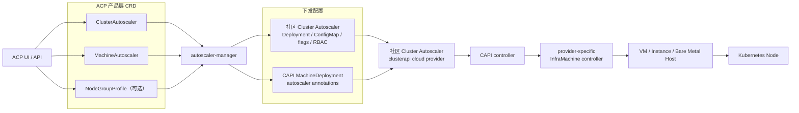
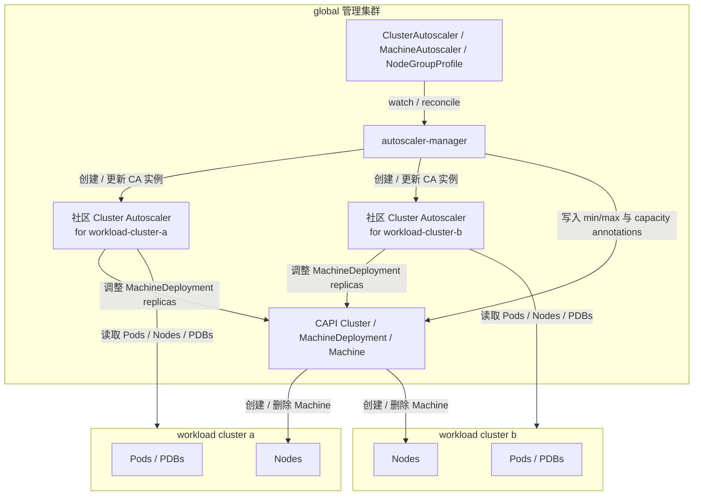

# ACP Cluster Autoscaler 方案设计

本文基于 `cluster-autoscaler-ocp-community-research.md` 的调研结论，设计 ACP 的 Cluster Autoscaler 产品化方案。

ACP 的前提假设是：ACP 对接的基础设施 provider 都基于 Cluster API（CAPI）实现，节点生命周期管理抽象更接近 CAPI `MachineDeployment` / `Machine` / `InfraMachine`，而不是 OpenShift Machine API。

本文中的 `ClusterAutoscaler`、`MachineAutoscaler`、`NodeGroupProfile` 和 `autoscaler-manager` 是 ACP 产品层设计建议，最终 API group、字段名和 controller 行为以 ACP API 评审结果为准。

## 1. 方案摘要

ACP 推荐采用：

```text
ACP 产品层 CRD
  -> autoscaler-manager
  -> 社区 Kubernetes Cluster Autoscaler
  -> --cloud-provider=clusterapi
  -> CAPI MachineDeployment
  -> CAPI Machine / InfraMachine
  -> VM / Instance / Bare Metal Host
  -> Kubernetes Node
```

核心设计：

- 底层复用社区 Cluster Autoscaler 和内置 `clusterapi` cloud provider。
- ACP 初版只把 CAPI `MachineDeployment` 作为 autoscaler node group，不暴露 `MachineSet` / `MachinePool`。
- ACP 提供 OCP 风格的产品体验：
  - `ClusterAutoscaler`：集群级 autoscaler 实例和全局策略。
  - `MachineAutoscaler`：单个 `MachineDeployment` 的 min/max。
  - `NodeGroupProfile`：从 0 扩容所需的新节点调度画像，可选增强能力。
- 新增 `autoscaler-manager`，负责把 ACP CR 翻译为社区 Cluster Autoscaler Deployment、ConfigMap、RBAC、flags 和 CAPI annotations。
- 实时扩缩容决策仍由社区 Cluster Autoscaler 完成，ACP controller 不参与每次 Pending Pod 的调度模拟。

一句话结论：**ACP 对齐 OCP 的产品体验和职责拆分，但底层复用社区 Cluster Autoscaler + CAPI provider，不复刻 OCP Machine API，也不开发新的 Cluster Autoscaler cloud provider。**

## 2. 目标与非目标

### 2.1 目标

1. 为 ACP 的 CAPI 集群提供节点自动扩缩容能力。
2. 使用社区 Cluster Autoscaler 的成熟调度模拟、expander 和缩容能力。
3. 提供面向用户的 CRD 产品接口，避免用户直接维护 Cluster Autoscaler flags、ConfigMap 和 CAPI annotations。
4. 初版稳定支持 CAPI `MachineDeployment` autoscaling。
5. 普通扩缩容作为基础能力，从 0 扩容作为 provider 可选增强能力。
6. 在 ACP status 中暴露 autoscaler 实例部署、annotation 同步、模板缺失、模板漂移、缩容阻塞等状态。

### 2.2 非目标

1. 不引入 OpenShift Machine API。
2. 不开发 ACP 自己的 Cluster Autoscaler cloud provider。
3. 初版不把 CAPI `MachineSet` / `MachinePool` 暴露为产品层 node group。
4. 不让 `autoscaler-manager` 实时执行扩缩容决策。
5. 不要求所有 provider 都支持 `minReplicas: 0`。
6. 不覆盖 HPA、VPA、KEDA 等 workload 级弹性能力。

## 3. 总体架构

ACP autoscaling 方案由三层组成：

| 层次 | 组件 | 职责 |
|---|---|---|
| 产品层 | ACP `ClusterAutoscaler` / `MachineAutoscaler` / `NodeGroupProfile` | 提供用户可理解、可审计、可校验的 autoscaling API。 |
| 翻译层 | `autoscaler-manager` | 把 ACP CR 翻译为社区 CA 实例、ConfigMap、RBAC、flags 和 CAPI annotations。 |
| 执行层 | 社区 Cluster Autoscaler + CAPI controller + provider controller | 发现 Pending Pod / 低利用率 Node，调整 `MachineDeployment.replicas`，创建或删除真实机器。 |

整体链路图：



### 3.1 部署模型

建议把社区 Cluster Autoscaler 部署在 global 管理集群中，但实例粒度按 workload cluster 拆分。



这样设计的原因：

- Cluster Autoscaler 的决策边界天然是单个 workload cluster。
- ACP 的 CAPI 对象和 provider controller 位于 global 管理集群，CA 部署在 global 更靠近 CAPI 控制面。
- 每套 CA 通过 workload kubeconfig 访问目标业务集群，通过 management kubeconfig 或 in-cluster 权限访问 global 中的 CAPI 对象。
- 不需要把 global 管理集群的高权限凭据下发到业务集群。
- `autoscaler-manager` 可以统一管理 per-cluster CA 实例的创建、升级、参数和删除。

### 3.2 组件职责边界

| 组件 | 负责什么 | 不负责什么 |
|---|---|---|
| ACP `ClusterAutoscaler` | 声明是否为某业务集群部署 CA，以及集群级策略 | 不直接做扩缩容决策 |
| ACP `MachineAutoscaler` | 声明某个 `MachineDeployment` 的 min/max | 不保存机器模板，不创建机器 |
| ACP `NodeGroupProfile` | 描述从 0 扩容时新节点的调度画像 | 不管理副本数，不创建机器 |
| `autoscaler-manager` | reconcile CA 实例和 CAPI annotations | 不模拟调度，不实时决定扩缩容 |
| 社区 Cluster Autoscaler | 发现 Pending Pod / 低利用率 Node，做扩缩容决策 | 不管理 ACP 产品层 CR |
| CAPI / provider controller | 创建 / 删除真实机器并维护 Machine / Node 状态 | 不做 autoscaler 决策 |

两个 controller 的关系：

```text
autoscaler-manager
  -> watch ClusterAutoscaler，部署 / 更新每个业务集群对应的社区 CA 实例
  -> watch MachineAutoscaler、NodeGroupProfile，把配置写到 MachineDeployment annotations
  -> 不做实时扩缩容决策

社区 Cluster Autoscaler
  -> 实时发现 Pending Pod
  -> 做调度模拟、expander 选择和 scale-down 判断
  -> 修改 CAPI MachineDeployment replicas
```

### 3.3 基础能力与增强能力

ACP autoscaling 能力建议分成两层：

```text
基础能力：普通扩缩容
  -> 适用于已有节点的 node group
  -> 依赖 ClusterAutoscaler + MachineAutoscaler
  -> 不要求 provider 上报 NodeGroupProfile

可选增强：从 0 扩容
  -> 适用于 minReplicas: 0 的 node group
  -> 额外依赖 provider 上报 ready 的 NodeGroupProfile
  -> autoscaler-manager 生成 scale-from-zero annotations
```

## 4. CRD 设计总览

ACP 建议新增三个产品层 CRD：

| CRD | 粒度 | 必需性 | 作用 |
|---|---|---|---|
| `ClusterAutoscaler` | 每个 workload cluster 一份 | 必需 | 声明目标业务集群、是否启用 autoscaler、集群级资源限制、缩容策略、expander 策略和 CA 部署配置。 |
| `MachineAutoscaler` | 每个可扩缩容 `MachineDeployment` 一份 | 必需 | 声明单个 node group 的 `minReplicas` / `maxReplicas`，并引用目标 CAPI `MachineDeployment`。 |
| `NodeGroupProfile` | 每个支持从 0 扩容的 node group 一份 | 可选 | 描述新节点的调度画像，例如 CPU、memory、labels、taints、GPU；由 provider controller 同步。 |

推荐命名和引用规则：

- 三类 ACP CR 建议位于 global 管理集群的 `cpaas-system` namespace。
- `ClusterAutoscaler` 与 workload cluster 一对一。
- `MachineAutoscaler` 与目标 CAPI `MachineDeployment` 一对一。
- `MachineAutoscaler.spec.clusterRef` 指向目标 CAPI `Cluster`，用于定位 CAPI namespace。
- `MachineAutoscaler.spec.scaleTargetRef` 只引用同一 CAPI namespace 下的 `MachineDeployment`，初版不支持跨 namespace node group 引用。
- `NodeGroupProfile` 与引用它的 `MachineAutoscaler` 位于同一 namespace，建议名称与目标 `MachineDeployment` 一致。

## 5. ClusterAutoscaler CRD

`ClusterAutoscaler` 声明“为哪个业务集群部署 autoscaler 实例”以及该实例的集群级参数。

OCP 的 `ClusterAutoscaler` 位于被管理集群内，天然只代表当前集群；ACP 的 `ClusterAutoscaler` 位于 global 管理集群内，因此需要通过 `clusterRef` 指明目标业务集群。

### 5.1 示例

```yaml
apiVersion: autoscaling.acp.example.io/v1alpha1
kind: ClusterAutoscaler
metadata:
  name: provider-cluster-a
  namespace: cpaas-system
spec:
  enabled: true
  clusterRef:
    apiVersion: cluster.x-k8s.io/v1beta1
    kind: Cluster
    namespace: provider-cluster-a
    name: provider-cluster-a
  workloadKubeconfigRef:
    name: provider-cluster-a-kubeconfig
    namespace: cpaas-system
  managementKubeconfigRef:
    name: global-kubeconfig
    namespace: cpaas-system
  nodeGroupDiscovery:
    namespace: provider-cluster-a
    clusterName: provider-cluster-a
  resourceLimits:
    maxNodesTotal: 100
    cores:
      min: 8
      max: 200
    memory:
      min: 32
      max: 1024
  scaleDown:
    enabled: true
    unneededTime: 10m
    utilizationThreshold: "0.5"
    skipNodesWithLocalStorage: true
    skipNodesWithSystemPods: true
  expander:
    strategies:
      - priority
      - least-waste
    priorityConfig:
      priorities:
        - priority: 100
          nodeGroups:
            - ".*gpu.*"
        - priority: 50
          nodeGroups:
            - ".*worker.*"
  deployment:
    image: registry.example.io/autoscaler/cluster-autoscaler:v1.35.0
    replicas: 1
    resources:
      requests:
        cpu: 100m
        memory: 256Mi
      limits:
        cpu: 500m
        memory: 512Mi
    logLevel: 4
```

### 5.2 spec 字段定义

| 字段 | 类型 | 必需 | 含义 |
|---|---|---|---|
| `spec.enabled` | `bool` | 是 | 是否为目标 workload cluster 启用 autoscaler。`false` 表示 `autoscaler-manager` 应删除或暂停对应 CA 实例，并清晰写入 status。 |
| `spec.clusterRef` | `ObjectReference` | 是 | 指向目标业务集群对应的 CAPI `Cluster`。`autoscaler-manager` 使用它确定 workload cluster 身份和 CAPI namespace。 |
| `spec.clusterRef.apiVersion` | `string` | 是 | 目标 CAPI `Cluster` 的 API 版本，例如 `cluster.x-k8s.io/v1beta1`。 |
| `spec.clusterRef.kind` | `string` | 是 | 目标对象类型，初版固定为 `Cluster`。 |
| `spec.clusterRef.namespace` | `string` | 是 | 目标 CAPI `Cluster` 所在 namespace，也是初版查找 `MachineDeployment` 的 namespace。 |
| `spec.clusterRef.name` | `string` | 是 | 目标 CAPI `Cluster` 名称。 |
| `spec.workloadKubeconfigRef` | `SecretReference` | 是 | 指向访问 workload cluster 的 kubeconfig Secret。社区 CA 使用它读取 Pods、Nodes、PDBs，并执行 drain / eviction。 |
| `spec.workloadKubeconfigRef.name` | `string` | 是 | workload kubeconfig Secret 名称。 |
| `spec.workloadKubeconfigRef.namespace` | `string` | 否 | workload kubeconfig Secret namespace；未设置时默认与 `ClusterAutoscaler` 同 namespace。 |
| `spec.managementKubeconfigRef` | `SecretReference` | 否 | 指向访问 global 管理集群的 kubeconfig Secret。若 CA 使用 in-cluster RBAC 访问 CAPI 对象，可不填。 |
| `spec.managementKubeconfigRef.name` | `string` | 条件必需 | management kubeconfig Secret 名称；当不使用 in-cluster 权限时必填。 |
| `spec.managementKubeconfigRef.namespace` | `string` | 否 | management kubeconfig Secret namespace；未设置时默认与 `ClusterAutoscaler` 同 namespace。 |
| `spec.nodeGroupDiscovery` | `NodeGroupDiscovery` | 是 | CAPI node group 自动发现配置，会被翻译为 `--node-group-auto-discovery=clusterapi:...`。 |
| `spec.nodeGroupDiscovery.namespace` | `string` | 是 | CAPI node group 所在 namespace。初版建议与 `clusterRef.namespace` 相同。 |
| `spec.nodeGroupDiscovery.clusterName` | `string` | 是 | CAPI cluster 名称，用于限制 CA 只发现该 workload cluster 的 node group。 |
| `spec.resourceLimits` | `ResourceLimits` | 否 | 集群级资源边界，作用于整个 workload cluster，不只统计 `MachineAutoscaler` 管理的节点组。 |
| `spec.resourceLimits.maxNodesTotal` | `int32` | 否 | 目标 workload cluster 的总节点数上限，翻译为 `--max-nodes-total`。主要限制后续扩容。 |
| `spec.resourceLimits.cores` | `ResourceRange` | 否 | 目标 workload cluster 的 CPU 总量上下限，翻译为 `--cores-total=<min>:<max>`。 |
| `spec.resourceLimits.cores.min` | `int64` | 否 | 缩容后不应低于的 CPU core 总量。 |
| `spec.resourceLimits.cores.max` | `int64` | 否 | 扩容后不应超过的 CPU core 总量。 |
| `spec.resourceLimits.memory` | `ResourceRange` | 否 | 目标 workload cluster 的 memory 总量上下限，翻译为 `--memory-total=<min>:<max>`。单位建议固定为 GiB 整数。 |
| `spec.resourceLimits.memory.min` | `int64` | 否 | 缩容后不应低于的 memory GiB 总量。 |
| `spec.resourceLimits.memory.max` | `int64` | 否 | 扩容后不应超过的 memory GiB 总量。 |
| `spec.scaleDown` | `ScaleDownConfig` | 否 | 缩容策略配置。未设置时使用 ACP 默认值或社区 CA 默认值。 |
| `spec.scaleDown.enabled` | `bool` | 否 | 是否启用缩容，翻译为 `--scale-down-enabled`。 |
| `spec.scaleDown.unneededTime` | `Duration` | 否 | 节点持续低利用率多久后可被视为缩容候选，翻译为 `--scale-down-unneeded-time`。 |
| `spec.scaleDown.utilizationThreshold` | `string` | 否 | 节点利用率低于该阈值时可成为缩容候选，翻译为 `--scale-down-utilization-threshold`。建议使用字符串避免浮点精度歧义。 |
| `spec.scaleDown.skipNodesWithLocalStorage` | `bool` | 否 | 是否跳过包含本地存储 Pod 的节点，翻译为 `--skip-nodes-with-local-storage`。 |
| `spec.scaleDown.skipNodesWithSystemPods` | `bool` | 否 | 是否跳过包含系统 Pod 的节点，翻译为 `--skip-nodes-with-system-pods`。 |
| `spec.expander` | `ExpanderConfig` | 否 | 扩容候选 node group 的选择策略。 |
| `spec.expander.strategies` | `[]string` | 否 | expander 链，例如 `priority,least-waste`，翻译为 `--expander=priority,least-waste`。 |
| `spec.expander.priorityConfig` | `PriorityExpanderConfig` | 条件必需 | 当 strategies 包含 `priority` 时使用，由 `autoscaler-manager` 同步为 workload cluster 中固定名称的 priority ConfigMap。 |
| `spec.expander.priorityConfig.priorities` | `[]PriorityRule` | 否 | priority expander 规则列表，数字越大优先级越高。 |
| `spec.expander.priorityConfig.priorities[].priority` | `int32` | 是 | 一组 node group 正则的优先级。 |
| `spec.expander.priorityConfig.priorities[].nodeGroups` | `[]string` | 是 | 匹配 node group 名称的正则表达式列表。 |
| `spec.deployment` | `DeploymentConfig` | 否 | 社区 CA 实例的部署参数。 |
| `spec.deployment.image` | `string` | 否 | 社区 CA 镜像。未设置时使用 ACP 默认镜像。 |
| `spec.deployment.replicas` | `int32` | 否 | CA Deployment 副本数。通常为 `1`，因为 CA 通过 leader election 或单实例运行控制决策。 |
| `spec.deployment.resources` | `ResourceRequirements` | 否 | CA Pod 的 requests / limits。 |
| `spec.deployment.resources.requests` | `map[string]string` | 否 | CA Pod 资源请求，例如 CPU、memory。 |
| `spec.deployment.resources.limits` | `map[string]string` | 否 | CA Pod 资源限制。 |
| `spec.deployment.logLevel` | `int32` | 否 | CA 日志等级，翻译为 `--v=<level>`。 |
| `spec.extraArgs` | `map[string]string` | 否 | 高级扩展参数，用于透传少量社区 CA flags。建议受 allowlist 限制，避免破坏 ACP 产品语义。 |

### 5.3 status 字段定义

| 字段 | 类型 | 含义 |
|---|---|---|
| `status.observedGeneration` | `int64` | controller 最近处理过的 `metadata.generation`。 |
| `status.conditions` | `[]Condition` | 标准 Kubernetes conditions，用于表达 Ready、Deployed、ConfigSynced、WorkloadReachable、ManagementReachable 等状态。 |
| `status.conditions[].type` | `string` | condition 类型，例如 `Ready`、`DeploymentReady`、`PriorityConfigSynced`。 |
| `status.conditions[].status` | `True/False/Unknown` | condition 状态。 |
| `status.conditions[].reason` | `string` | 机器可读原因，例如 `DeploymentAvailable`、`KubeconfigInvalid`、`PriorityConfigInvalid`。 |
| `status.conditions[].message` | `string` | 面向人的状态说明。 |
| `status.conditions[].lastTransitionTime` | `Time` | condition 最近一次状态变化时间。 |
| `status.deploymentRef` | `ObjectReference` | `autoscaler-manager` 创建的社区 CA Deployment 引用。 |
| `status.priorityConfigMapRef` | `ObjectReference` | 当启用 priority expander 时，workload cluster 中固定名称 priority ConfigMap 的引用信息。 |
| `status.lastAppliedArgs` | `[]string` | 最近一次下发给社区 CA 的关键 container args，便于排障。 |
| `status.managedNodeGroups` | `int32` | 当前通过 `MachineAutoscaler` 管理的 node group 数量。 |
| `status.message` | `string` | 聚合后的简短状态说明。 |

### 5.4 翻译规则

`autoscaler-manager` 将 `ClusterAutoscaler` 翻译为一组底层资源：

| ACP 字段 | 目标资源 / 参数 | 示例 |
|---|---|---|
| `clusterRef` / `nodeGroupDiscovery` | CA args | `--node-group-auto-discovery=clusterapi:namespace=provider-cluster-a,clusterName=provider-cluster-a` |
| `workloadKubeconfigRef` | Secret volume + CA args | `--kubeconfig=/etc/autoscaler/workload/kubeconfig` |
| `managementKubeconfigRef` | Secret volume + CA args | `--cloud-config=/etc/autoscaler/management/kubeconfig` |
| `resourceLimits.maxNodesTotal` | CA args | `--max-nodes-total=100` |
| `resourceLimits.cores` | CA args | `--cores-total=8:200` |
| `resourceLimits.memory` | CA args | `--memory-total=32:1024` |
| `scaleDown.enabled` | CA args | `--scale-down-enabled=true` |
| `scaleDown.unneededTime` | CA args | `--scale-down-unneeded-time=10m` |
| `scaleDown.utilizationThreshold` | CA args | `--scale-down-utilization-threshold=0.5` |
| `expander.strategies` | CA args | `--expander=priority,least-waste` |
| `expander.priorityConfig` | workload cluster ConfigMap | `cluster-autoscaler-priority-expander` |
| `deployment.image` | Deployment | `spec.template.spec.containers[].image` |
| `deployment.resources` | Deployment | `resources.requests/limits` |
| `deployment.logLevel` | CA args | `--v=4` |

### 5.5 priority expander 处理

社区 priority expander 固定读取名为 `cluster-autoscaler-priority-expander` 的 ConfigMap。该 ConfigMap 位于 Cluster Autoscaler 通过 `--kubeconfig` 访问的 workload cluster 中，namespace 由 `--namespace` 指定。

ACP 不要求用户直接维护这个 ConfigMap。用户在 `ClusterAutoscaler.spec.expander.priorityConfig` 中配置优先级，`autoscaler-manager` 使用 workload kubeconfig 同步到底层 ConfigMap。

如果 ConfigMap 同步失败或格式校验失败：

- `autoscaler-manager` 应在 `ClusterAutoscaler.status.conditions` 中暴露错误。
- 社区 CA 可能跳过 priority expander，并继续使用 expander 链中的后续策略，例如 `least-waste`。

## 6. MachineAutoscaler CRD

`MachineAutoscaler` 表达单个 CAPI `MachineDeployment` 的 autoscaler 边界。CR 的存在和有效配置表示该 `MachineDeployment` 允许自动扩缩容。

它对齐 OCP `MachineAutoscaler` 的产品语义：用户不直接编辑底层 node group annotation，而是通过面向节点组的产品层 CR 声明 min/max。区别在于 OCP 的目标对象是 OpenShift `MachineSet`，ACP 初版目标对象是 CAPI `MachineDeployment`。

### 6.1 示例

```yaml
apiVersion: autoscaling.acp.example.io/v1alpha1
kind: MachineAutoscaler
metadata:
  name: worker-md-0
  namespace: cpaas-system
spec:
  clusterRef:
    apiVersion: cluster.x-k8s.io/v1beta1
    kind: Cluster
    namespace: provider-cluster-a
    name: provider-cluster-a
  scaleTargetRef:
    apiVersion: cluster.x-k8s.io/v1beta1
    kind: MachineDeployment
    name: worker-md-0
  minReplicas: 1
  maxReplicas: 10
```

从 0 扩容示例：

```yaml
apiVersion: autoscaling.acp.example.io/v1alpha1
kind: MachineAutoscaler
metadata:
  name: gpu-md-0
  namespace: cpaas-system
spec:
  clusterRef:
    apiVersion: cluster.x-k8s.io/v1beta1
    kind: Cluster
    namespace: provider-cluster-a
    name: provider-cluster-a
  scaleTargetRef:
    apiVersion: cluster.x-k8s.io/v1beta1
    kind: MachineDeployment
    name: gpu-md-0
  minReplicas: 0
  maxReplicas: 5
  nodeGroupProfileRef:
    name: gpu-md-0
```

### 6.2 spec 字段定义

| 字段 | 类型 | 必需 | 含义 |
|---|---|---|---|
| `spec.clusterRef` | `ObjectReference` | 是 | 指向目标业务集群对应的 CAPI `Cluster`。用于确定目标 `MachineDeployment` 所在 CAPI namespace，并关联到对应 `ClusterAutoscaler`。 |
| `spec.clusterRef.apiVersion` | `string` | 是 | 目标 CAPI `Cluster` 的 API 版本。 |
| `spec.clusterRef.kind` | `string` | 是 | 目标对象类型，初版固定为 `Cluster`。 |
| `spec.clusterRef.namespace` | `string` | 是 | 目标 CAPI `Cluster` namespace。初版要求目标 `MachineDeployment` 与该 `Cluster` 位于同一 namespace。 |
| `spec.clusterRef.name` | `string` | 是 | 目标 CAPI `Cluster` 名称。 |
| `spec.scaleTargetRef` | `ScaleTargetReference` | 是 | 指向要自动扩缩容的 CAPI node group。初版只支持 `MachineDeployment`。 |
| `spec.scaleTargetRef.apiVersion` | `string` | 是 | 目标 node group API 版本，例如 `cluster.x-k8s.io/v1beta1`。 |
| `spec.scaleTargetRef.kind` | `string` | 是 | 目标 node group 类型，初版固定为 `MachineDeployment`。 |
| `spec.scaleTargetRef.name` | `string` | 是 | 目标 `MachineDeployment` 名称。不包含 namespace，namespace 由 `clusterRef.namespace` 推导。 |
| `spec.minReplicas` | `int32` | 是 | node group 最小副本数。翻译为 CAPI autoscaler min-size annotation。值为 `0` 时表示允许从 0 扩容，需要额外满足 `NodeGroupProfile` ready。 |
| `spec.maxReplicas` | `int32` | 是 | node group 最大副本数。翻译为 CAPI autoscaler max-size annotation。必须大于等于 `minReplicas`。 |
| `spec.nodeGroupProfileRef` | `LocalObjectReference` | 条件必需 | 从 0 扩容时引用同 namespace 下的 `NodeGroupProfile`。当 `minReplicas: 0` 且 provider 不能通过 infra template status 提供完整模板信息时必填；ACP 初版建议直接要求必填。 |
| `spec.nodeGroupProfileRef.name` | `string` | 条件必需 | `NodeGroupProfile` 名称，建议与目标 `MachineDeployment` 名称一致。 |

### 6.3 status 字段定义

| 字段 | 类型 | 含义 |
|---|---|---|
| `status.observedGeneration` | `int64` | controller 最近处理过的 `metadata.generation`。 |
| `status.conditions` | `[]Condition` | 标准 conditions，用于表达 Ready、TargetFound、AnnotationsSynced、ScaleFromZeroReady、ProfileReady 等状态。 |
| `status.conditions[].type` | `string` | condition 类型，例如 `Ready`、`TargetFound`、`AnnotationsSynced`、`ScaleFromZeroReady`。 |
| `status.conditions[].status` | `True/False/Unknown` | condition 状态。 |
| `status.conditions[].reason` | `string` | 机器可读原因，例如 `MachineDeploymentNotFound`、`InvalidReplicaRange`、`NodeGroupProfileNotReady`。 |
| `status.conditions[].message` | `string` | 面向人的状态说明。 |
| `status.conditions[].lastTransitionTime` | `Time` | condition 最近一次状态变化时间。 |
| `status.targetRef` | `ObjectReference` | 实际解析到的目标 `MachineDeployment` 引用。 |
| `status.currentReplicas` | `int32` | 目标 `MachineDeployment.status.replicas` 或当前可观测副本数。 |
| `status.minReplicas` | `int32` | 最近一次成功同步到目标 `MachineDeployment` annotation 的 min。 |
| `status.maxReplicas` | `int32` | 最近一次成功同步到目标 `MachineDeployment` annotation 的 max。 |
| `status.lastSyncedAnnotations` | `map[string]string` | 最近一次由 `autoscaler-manager` 写入的关键 autoscaler annotations。 |
| `status.message` | `string` | 聚合后的简短状态说明。 |

### 6.4 翻译规则

`autoscaler-manager` 将 `MachineAutoscaler` 的 min/max 写入目标 `MachineDeployment` annotations：

```yaml
metadata:
  annotations:
    cluster.x-k8s.io/cluster-api-autoscaler-node-group-min-size: "1"
    cluster.x-k8s.io/cluster-api-autoscaler-node-group-max-size: "10"
```

规则：

1. `MachineAutoscaler` 与目标 `MachineDeployment` 一对一。
2. 初版只允许 `scaleTargetRef.kind=MachineDeployment`。
3. `autoscaler-manager` 通过 `clusterRef.namespace` 查找目标 `MachineDeployment`。
4. 当 `minReplicas > 0` 时，不要求 `NodeGroupProfile` 存在。
5. 当 `minReplicas = 0` 时，ACP 初版建议要求 `nodeGroupProfileRef` 存在且目标 `NodeGroupProfile` ready。
6. `minReplicas > maxReplicas` 应被 admission 或 controller 拒绝，并在 status 中标记不可用。
7. 如果目标 `MachineDeployment` 不存在或不属于 `clusterRef` 指向的 CAPI `Cluster`，应标记 `TargetFound=False`。

## 7. NodeGroupProfile CRD

`NodeGroupProfile` 是 ACP 为从 0 扩容提出的可选产品层抽象，用于描述某个 node group 新扩出来的节点具备哪些调度属性。

它不是 Kubernetes Node 模板，也不是 CAPI `MachineTemplate`。它只服务于 Cluster Autoscaler 的调度模拟。

### 7.1 为什么需要 NodeGroupProfile

普通扩缩容通常可以从已有 Node 推断节点能力。但当 `MachineDeployment.replicas=0` 时，没有现成 Node 可参考，Cluster Autoscaler 需要额外知道新节点的 CPU、memory、labels、taints、GPU、topology 等信息。

这些信息在不同 provider 中来源不同：

```text
vSphere 可能在 VM class / template / hardware profile 中
HCS / DCS 可能在 flavor / SKU / profile 中
云 provider 可能在 instanceType 中
裸金属 provider 可能依赖 BareMetalHost inventory
```

ACP 不建议让 `autoscaler-manager` 解析所有 provider-specific 模板，而是由 provider controller 同步标准化的 `NodeGroupProfile`。

### 7.2 示例

```yaml
apiVersion: autoscaling.acp.example.io/v1alpha1
kind: NodeGroupProfile
metadata:
  name: gpu-md-0
  namespace: cpaas-system
spec:
  clusterRef:
    apiVersion: cluster.x-k8s.io/v1beta1
    kind: Cluster
    namespace: provider-cluster-a
    name: provider-cluster-a
  scaleTargetRef:
    apiVersion: cluster.x-k8s.io/v1beta1
    kind: MachineDeployment
    name: gpu-md-0
  capacity:
    cpu: "16"
    memory: "64Gi"
    ephemeralStorage: "100Gi"
    maxPods: 110
  labels:
    topology.kubernetes.io/zone: zone-a
    workload: batch
    node-type: gpu
  taints:
    - key: workload
      value: batch
      effect: NoSchedule
  volumeLimits:
    - csiDriver: ebs.csi.aws.com
      count: 25
  accelerators:
    - resourceName: nvidia.com/gpu
      count: 1
      type: gpu
status:
  observedGeneration: 1
  conditions:
    - type: Ready
      status: "True"
      reason: ProfileSynced
      message: Node group profile is ready for scale from zero.
```

### 7.3 spec 字段定义

| 字段 | 类型 | 必需 | 含义 |
|---|---|---|---|
| `spec.clusterRef` | `ObjectReference` | 是 | 指向目标业务集群对应的 CAPI `Cluster`，用于确认该 profile 属于哪个 workload cluster。 |
| `spec.clusterRef.apiVersion` | `string` | 是 | 目标 CAPI `Cluster` 的 API 版本。 |
| `spec.clusterRef.kind` | `string` | 是 | 目标对象类型，初版固定为 `Cluster`。 |
| `spec.clusterRef.namespace` | `string` | 是 | 目标 CAPI `Cluster` namespace。 |
| `spec.clusterRef.name` | `string` | 是 | 目标 CAPI `Cluster` 名称。 |
| `spec.scaleTargetRef` | `ScaleTargetReference` | 是 | 指向该 profile 描述的 node group。初版只支持 `MachineDeployment`。 |
| `spec.scaleTargetRef.apiVersion` | `string` | 是 | 目标 node group API 版本。 |
| `spec.scaleTargetRef.kind` | `string` | 是 | 目标 node group 类型，初版固定为 `MachineDeployment`。 |
| `spec.scaleTargetRef.name` | `string` | 是 | 目标 `MachineDeployment` 名称。 |
| `spec.capacity` | `NodeCapacity` | 是 | 新节点的资源容量。CPU 和 memory 是从 0 扩容调度模拟的最低要求。 |
| `spec.capacity.cpu` | `Quantity` | 是 | 新节点 CPU capacity，例如 `16` 或 `16000m`，翻译为 `capacity.cluster-autoscaler.kubernetes.io/cpu`。 |
| `spec.capacity.memory` | `Quantity` | 是 | 新节点 memory capacity，例如 `64Gi`，翻译为 `capacity.cluster-autoscaler.kubernetes.io/memory`。 |
| `spec.capacity.ephemeralStorage` | `Quantity` | 否 | 新节点临时存储 capacity，翻译为 `capacity.cluster-autoscaler.kubernetes.io/ephemeral-disk`。 |
| `spec.capacity.maxPods` | `int32` | 否 | 新节点最大 Pod 数，翻译为 `capacity.cluster-autoscaler.kubernetes.io/maxPods`。未设置时社区 CA 通常按 `110` 处理。 |
| `spec.labels` | `map[string]string` | 否 | 新节点预期 labels，用于模拟 `nodeSelector` / node affinity / topology 约束，翻译为 capacity labels annotation。 |
| `spec.taints` | `[]Taint` | 否 | 新节点预期 taints，用于模拟 tolerations，翻译为 capacity taints annotation。 |
| `spec.taints[].key` | `string` | 是 | taint key。 |
| `spec.taints[].value` | `string` | 否 | taint value。 |
| `spec.taints[].effect` | `string` | 是 | taint effect，例如 `NoSchedule`、`PreferNoSchedule`、`NoExecute`。 |
| `spec.volumeLimits` | `[]VolumeLimit` | 否 | 新节点的 CSI volume limit 信息。 |
| `spec.volumeLimits[].csiDriver` | `string` | 是 | CSI driver 名称，例如 `ebs.csi.aws.com`。 |
| `spec.volumeLimits[].count` | `int32` | 是 | 该 CSI driver 在单节点上的 volume 数量上限。 |
| `spec.accelerators` | `[]Accelerator` | 否 | 新节点的 GPU 或其他加速器信息。 |
| `spec.accelerators[].resourceName` | `string` | 是 | Kubernetes extended resource 名称，例如 `nvidia.com/gpu`。 |
| `spec.accelerators[].count` | `int32` | 是 | 该资源在新节点上的数量。 |
| `spec.accelerators[].type` | `string` | 否 | 加速器类型说明，例如 `gpu`。用于产品展示或 provider 内部校验。 |
| `spec.accelerators[].draDriver` | `string` | 否 | Kubernetes DRA 场景下的 driver 名称。传统 device plugin 场景可不填。 |
| `spec.providerTemplateRef` | `ObjectReference` | 否 | provider controller 用于生成该 profile 的底层模板引用，例如 VM class、flavor 或 CAPI infra template。用于审计和漂移检测。 |
| `spec.providerTemplateRef.apiVersion` | `string` | 条件必需 | 底层模板 API 版本。填写 `providerTemplateRef` 时必填。 |
| `spec.providerTemplateRef.kind` | `string` | 条件必需 | 底层模板类型。填写 `providerTemplateRef` 时必填。 |
| `spec.providerTemplateRef.namespace` | `string` | 否 | 底层模板 namespace。 |
| `spec.providerTemplateRef.name` | `string` | 条件必需 | 底层模板名称。填写 `providerTemplateRef` 时必填。 |

### 7.4 status 字段定义

| 字段 | 类型 | 含义 |
|---|---|---|
| `status.observedGeneration` | `int64` | provider controller 最近处理过的 `metadata.generation`。 |
| `status.conditions` | `[]Condition` | 标准 conditions，用于表达 Ready、Synced、Drifted、TemplateResolved、CapacityResolved 等状态。 |
| `status.conditions[].type` | `string` | condition 类型，例如 `Ready`、`Drifted`、`TemplateResolved`。 |
| `status.conditions[].status` | `True/False/Unknown` | condition 状态。 |
| `status.conditions[].reason` | `string` | 机器可读原因，例如 `ProfileSynced`、`TemplateNotFound`、`CapacityMissing`、`TemplateDrifted`。 |
| `status.conditions[].message` | `string` | 面向人的状态说明。 |
| `status.conditions[].lastTransitionTime` | `Time` | condition 最近一次状态变化时间。 |
| `status.sourceHash` | `string` | provider controller 根据底层模板计算的 hash，用于识别 profile 是否与真实模板一致。 |
| `status.lastSyncedTime` | `Time` | 最近一次成功同步 profile 的时间。 |
| `status.message` | `string` | 聚合后的简短状态说明。 |

### 7.5 翻译规则

当 `MachineAutoscaler.spec.minReplicas=0` 且 `NodeGroupProfile` ready 时，`autoscaler-manager` 将 profile 翻译为目标 `MachineDeployment` 的 scale-from-zero annotations。

示例：

```yaml
metadata:
  annotations:
    cluster.x-k8s.io/cluster-api-autoscaler-node-group-min-size: "0"
    cluster.x-k8s.io/cluster-api-autoscaler-node-group-max-size: "5"
    capacity.cluster-autoscaler.kubernetes.io/cpu: "16"
    capacity.cluster-autoscaler.kubernetes.io/memory: "64Gi"
    capacity.cluster-autoscaler.kubernetes.io/ephemeral-disk: "100Gi"
    capacity.cluster-autoscaler.kubernetes.io/maxPods: "110"
    capacity.cluster-autoscaler.kubernetes.io/labels: "topology.kubernetes.io/zone=zone-a,workload=batch,node-type=gpu"
    capacity.cluster-autoscaler.kubernetes.io/taints: "workload=batch:NoSchedule"
    capacity.cluster-autoscaler.kubernetes.io/csi-driver: "ebs.csi.aws.com=25"
    capacity.cluster-autoscaler.kubernetes.io/gpu-type: "nvidia.com/gpu"
    capacity.cluster-autoscaler.kubernetes.io/gpu-count: "1"
```

规则：

1. CPU 和 memory 缺失时，`NodeGroupProfile` 不应 ready。
2. `NodeGroupProfile` 未 ready 时，`autoscaler-manager` 不应把 `minReplicas: 0` 标记为可用。
3. provider 模板变化但 profile 未同步时，provider controller 应标记 `Drifted=True`。
4. `autoscaler-manager` 看到 drift 状态后，应在 `MachineAutoscaler.status` 中暴露风险。
5. DRA 场景使用 `draDriver`；传统 device plugin 场景使用 `resourceName` 翻译为 `gpu-type`，不要让两者同时代表同一个 GPU 资源。

## 8. autoscaler-manager 设计

`autoscaler-manager` 是 ACP 新增 controller，负责产品层 CRD 与底层社区 Cluster Autoscaler / CAPI annotations 之间的翻译。

### 8.1 职责

`autoscaler-manager` 负责：

- watch `ClusterAutoscaler`，为目标 workload cluster 创建、更新或删除一套社区 Cluster Autoscaler 实例。
- 管理该实例所需的 Deployment、ServiceAccount、RBAC、Secret mount、ConfigMap 和 container args。
- watch `MachineAutoscaler`，把 min/max 同步到目标 CAPI `MachineDeployment` annotations。
- watch `NodeGroupProfile`，在从 0 扩容场景下把新节点调度画像同步为 capacity annotations。
- 使用 workload kubeconfig 同步 priority expander ConfigMap。
- 在 status 中暴露部署失败、kubeconfig 不可用、annotation 写入失败、目标对象不存在、profile 未 ready、profile drift 等问题。

`autoscaler-manager` 不负责：

- 不读取 Pending Pod 并做扩容决策。
- 不 drain Node。
- 不直接创建或删除 VM / 裸金属主机。
- 不解析所有 provider-specific 机器模板。

### 8.2 reconcile ClusterAutoscaler

当 `ClusterAutoscaler.spec.enabled=true`：

1. 校验 `clusterRef`、kubeconfig Secret 和 provider 支持矩阵。
2. 创建或更新社区 CA Deployment。
3. 创建或更新 ServiceAccount / RBAC。
4. 挂载 workload kubeconfig 和可选 management kubeconfig。
5. 生成 container args：
   - `--cloud-provider=clusterapi`
   - `--node-group-auto-discovery=clusterapi:namespace=<namespace>,clusterName=<clusterName>`
   - `--kubeconfig=<workload-kubeconfig-path>`
   - `--cloud-config=<management-kubeconfig-path>` 或使用 in-cluster config
   - resource limits / scale down / expander / logging flags
6. 如启用 priority expander，同步 workload cluster 中固定名称 ConfigMap。
7. 更新 `ClusterAutoscaler.status`。

当 `ClusterAutoscaler.spec.enabled=false`：

- 删除或暂停对应社区 CA 实例。
- 保留 `MachineAutoscaler` CR 本身，但不再让 CA 执行实时扩缩容。
- 在 status 中说明当前 disabled。

### 8.3 reconcile MachineAutoscaler

1. 通过 `clusterRef` 找到目标 CAPI namespace 和对应 `ClusterAutoscaler`。
2. 校验 `scaleTargetRef.kind=MachineDeployment`。
3. 查找目标 `MachineDeployment`。
4. 校验 `minReplicas <= maxReplicas`。
5. 写入 min/max annotations。
6. 如果 `minReplicas=0`：
   - 查找 `nodeGroupProfileRef`。
   - 校验 `NodeGroupProfile` ready 且未 drift。
   - 写入 capacity annotations。
7. 更新 `MachineAutoscaler.status`。

### 8.4 reconcile NodeGroupProfile

`NodeGroupProfile` 的主 owner 应是 provider controller，不是 `autoscaler-manager`。`autoscaler-manager` 只消费它：

1. watch profile 变化。
2. 找到引用该 profile 的 `MachineAutoscaler`。
3. 如果 profile ready，触发对应 `MachineAutoscaler` reconcile。
4. 如果 profile drift 或 not ready，更新对应 `MachineAutoscaler.status` 并避免宣称从 0 扩容可用。

## 9. 普通扩缩容流程

普通扩缩容不要求 `NodeGroupProfile`。

```text
用户创建 ClusterAutoscaler
  -> autoscaler-manager 部署社区 CA

用户创建 MachineAutoscaler(min=1,max=10)
  -> autoscaler-manager 写入 MachineDeployment min/max annotations

workload cluster 出现 Pending Pod
  -> 社区 CA 读取 Pending Pod / Node / PDB
  -> 社区 CA 发现可扩容 MachineDeployment
  -> 社区 CA 模拟新增节点
  -> 社区 CA 调整 MachineDeployment.replicas
  -> CAPI / provider controller 创建 Machine / InfraMachine
  -> 新 Node 加入 workload cluster
```

缩容流程：

```text
社区 CA 发现低利用率 Node
  -> 判断 Pod 是否可驱逐
  -> 模拟 Pod 是否能迁移到其他 Node
  -> cordon / drain Node
  -> 调整 MachineDeployment.replicas 或删除 Machine
  -> CAPI / provider controller 删除底层资源
```

ACP 需要在产品层暴露缩容阻塞原因，但不重新实现缩容判断。

## 10. 从 0 扩容流程

从 0 扩容是可选增强能力。

前提：

```text
目标 MachineDeployment replicas 可以为 0
+
MachineAutoscaler 允许 minReplicas: 0
+
provider 已同步 ready NodeGroupProfile
+
NodeGroupProfile 准确描述新节点调度属性
```

流程：

```text
provider controller 解析自己的机器模板 / flavor / SKU / inventory
  -> 同步 NodeGroupProfile
  -> 标记 Ready=True

用户创建或更新 MachineAutoscaler(min=0,max=N,nodeGroupProfileRef=...)
  -> autoscaler-manager 校验 NodeGroupProfile ready
  -> 写入 min/max annotations
  -> 写入 capacity annotations

workload cluster 出现 Pending Pod
  -> 社区 CA 读取 capacity annotations
  -> 构造 template node
  -> 判断该 node group 从 0 扩容后能否承载 Pending Pod
  -> 调整 MachineDeployment.replicas 从 0 到 1 或更多
  -> CAPI / provider controller 创建真实机器
  -> 新 Node 加入 workload cluster
```

如果 `NodeGroupProfile` 缺失、未 ready 或 drift：

- `MachineAutoscaler.status.ScaleFromZeroReady=False`。
- `autoscaler-manager` 不应宣称该 node group 支持从 0 扩容。
- 产品层应提示用户需要 provider 支持或修复模板同步。

## 11. provider 适配要求

普通扩缩容要求 provider 满足：

1. CAPI `MachineDeployment` 能创建和删除机器。
2. Machine / Node `providerID` 映射稳定。
3. 删除 CAPI `Machine` 能可靠释放底层 VM、实例或物理资源。
4. 目标 `MachineDeployment` 上的 min/max annotations 能被社区 CA 发现。
5. CA 能访问 workload cluster 和 global CAPI 对象。

从 0 扩容额外要求 provider 满足：

1. 能从 provider-specific 模板中推导新节点 CPU / memory。
2. 能推导必要 labels、taints、zone/topology、GPU、volume limits 等调度属性。
3. 能同步 `NodeGroupProfile` 并维护 Ready / Drift 状态。
4. 能保证 profile 与真实新节点模板一致。
5. 对裸金属场景，还需要确认节点库存、可分配 capacity、删除/回收语义和失败处理。

ACP 初版建议只为已验证 provider 开放 autoscaling。baremetal provider 是否纳入初版，需要单独确认库存、capacity、删除语义和 providerID 映射。

## 12. 可观测性与状态暴露

ACP 产品层至少应暴露以下状态：

| 状态类别 | 建议暴露位置 | 示例 |
|---|---|---|
| CA 实例部署状态 | `ClusterAutoscaler.status.conditions` | Deployment 未 ready、镜像拉取失败、RBAC 缺失。 |
| workload cluster 访问状态 | `ClusterAutoscaler.status.conditions` | kubeconfig 无效、API server 不可达。 |
| management cluster 访问状态 | `ClusterAutoscaler.status.conditions` | 无法访问 CAPI 对象。 |
| priority ConfigMap 同步状态 | `ClusterAutoscaler.status.conditions` | ConfigMap 写入失败、格式错误。 |
| node group 目标解析状态 | `MachineAutoscaler.status.conditions` | `MachineDeployment` 不存在、kind 不支持。 |
| annotation 同步状态 | `MachineAutoscaler.status.conditions` | min/max 写入失败、权限不足、冲突。 |
| 从 0 扩容状态 | `MachineAutoscaler.status.conditions` | profile 缺失、profile 未 ready、profile drift。 |
| provider 模板同步状态 | `NodeGroupProfile.status.conditions` | 模板不存在、capacity 缺失、profile 已漂移。 |
| 缩容阻塞原因 | CA metrics / events / ACP 聚合状态 | PDB 阻塞、本地存储、系统 Pod、无法重新调度。 |

状态设计原则：

- status 要告诉用户“为什么不能扩缩容”，而不只是 `Ready=False`。
- 对 provider 能修复的问题，例如 profile drift，应指出来源模板和最后同步时间。
- 对用户配置错误，例如 `minReplicas > maxReplicas`，应在 admission 或 status 中尽早反馈。
- 对社区 CA 决策结果，应优先复用 CA events、logs、metrics，再由 ACP 聚合展示。

## 13. 风险与待确认项

1. 目标 Cluster Autoscaler / CAPI provider 版本是否完整支持 `MachineDeployment` autoscaling、min/max annotations、auto discovery 和删除语义。
2. 目标版本是否支持 ACP 计划使用的 capacity annotations 或 infra template `status.capacity` / `status.nodeSystemInfo`。
3. Machine / Node `providerID` 映射是否稳定；映射不正确会导致 CA 无法判断 Node 属于哪个 node group。
4. 删除 CAPI `Machine` 是否可靠释放底层资源；缩容最终依赖 provider 删除语义。
5. priority expander ConfigMap 名称固定为 `cluster-autoscaler-priority-expander`，需要由 `autoscaler-manager` 写入 workload cluster，而不是 global cluster。
6. `minReplicas: 0` 不应作为所有 provider 的默认能力；只有 provider 能提供准确新节点调度画像时才开放。
7. `NodeGroupProfile` 必须暴露 ready / drift 状态，避免 autoscaler 使用过期画像做调度模拟。
8. baremetal provider 如果要纳入 autoscaling，需要单独确认节点库存、capacity、删除语义、providerID 映射以及从 0 扩容模板来源。
9. `maxNodesTotal`、`cores-total`、`memory-total` 是 workload cluster 维度的总量边界，不是只统计 `MachineAutoscaler` 管理的节点组，也不等价于 ACP 平台 quota。
10. Cluster Autoscaler 缩容会触发 Pod 驱逐和节点删除，ACP 需要在产品层暴露缩容阻塞原因和驱逐风险。

## 14. 推荐落地路径

1. 先实现社区 Cluster Autoscaler + `clusterapi` provider 的 per-workload-cluster 部署能力。
2. 新增 ACP `ClusterAutoscaler` CRD，由 `autoscaler-manager` 管理 CA Deployment、RBAC、kubeconfig、flags 和 priority ConfigMap。
3. 新增 ACP `MachineAutoscaler` CRD，初版只支持 CAPI `MachineDeployment`，并同步 min/max annotations。
4. 先支持普通扩缩容，不强制要求 provider 上报 `NodeGroupProfile`。
5. 在已验证 provider 上引入 `NodeGroupProfile`，开放 `minReplicas: 0`。
6. 将 priority expander 产品化为 `ClusterAutoscaler.spec.expander.priorityConfig`，由 `autoscaler-manager` 同步 workload cluster 中固定名称 ConfigMap。
7. 完善 status、events 和 metrics，让用户能看到 CA 实例部署状态、node group 同步状态、profile 状态和缩容阻塞原因。
8. 对每个 provider 建立 autoscaling 支持矩阵，明确普通扩缩容、从 0 扩容、GPU、裸金属等能力边界。

最终建议：

```text
ACP 应以社区 Cluster Autoscaler + CAPI provider 作为底层方案，先支持基于 MachineDeployment 的普通扩缩容；从 0 扩容作为 provider 可选增强能力，仅在 provider 上报 ready NodeGroupProfile 时启用。产品层新增 ClusterAutoscaler / MachineAutoscaler / NodeGroupProfile / autoscaler-manager，提供 OCP 风格体验，但不绑定 OCP Machine API。
```
